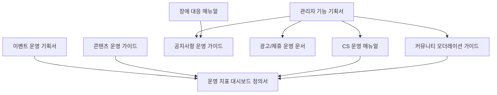

# 급여납치 운영·관리자 문서 10종 최종본 INDEX

---

## 문서 통제 정보

| 항목        | 내용                                                                                   |
| ----------- | -------------------------------------------------------------------------------------- |
| 프로젝트    | 급여납치 Salary Hijacking 플랫폼                                                       |
| 문서 상태   | 문서상·이론상 최종본                                                                   |
| 기준일      | 2026-06-15                                                                             |
| 적용 범위   | 모바일 앱, API 서버, Neon DB, Cloudflare, GitHub 기반 운영 환경                        |
| 핵심 도메인 | 급여 관리, 예산 관리, 지출 기록, 레벨업, 커뮤니티, 알림, 광고/제휴, 관리자 운영        |
| 운영 기준   | 사용자의 급여·대출·저축·소비 내역은 서비스 내부에서 고위험 재무성 개인정보로 취급한다. |
| 변경 원칙   | 본 문서의 기준 변경은 운영 책임자, 제품 책임자, 기술 책임자 승인 후 버전 관리한다.     |

---

## 1. 문서 세트 구성

| 번호 | 파일명                     | 목적                         | 최종 산출물 기준                                           |
| ---: | -------------------------- | ---------------------------- | ---------------------------------------------------------- |
|   01 | 관리자 기능 기획서         | 운영툴 구현 기준 확정        | 회원, 게시글, 신고, 공지, 배너, 권한, 감사로그까지 정의    |
|   02 | CS 운영 매뉴얼             | 고객 문의 대응 기준 확정     | 로그인, 데이터 삭제, 신고, 알림, 결제/광고 문의까지 대응   |
|   03 | FAQ 문서                   | 사용자 자가 해결 문구 확정   | 납치금액, 급여 입력, 지출 수정, 레벨업, 커뮤니티 질문 포함 |
|   04 | 공지사항 운영 가이드       | 앱 내 공지 운영 기준 확정    | 점검, 업데이트, 이벤트, 정책 변경 공지 절차 포함           |
|   05 | 이벤트 운영 기획서         | 포인트/보상 운영 기준 확정   | 달성 이벤트, 미션 보상, 지급 조건, 악용 방지 포함          |
|   06 | 광고/제휴 운영 문서        | 수익화 운영 기준 확정        | 배너 등록, 노출 위치, 클릭 로그, 심사 기준 포함            |
|   07 | 콘텐츠 운영 가이드         | 레벨업 콘텐츠 관리 기준 확정 | 독서, 뉴스, 영어, 홈트 미션 편성 기준 포함                 |
|   08 | 커뮤니티 모더레이션 가이드 | 게시판 품질 관리 기준 확정   | 신고 처리, 삭제 기준, 제재 단계, 익명글 처리 포함          |
|   09 | 장애 대응 매뉴얼           | 서비스 중단 대응 기준 확정   | 장애 등급, 담당, 복구, 사용자 공지, 사후 보고 포함         |
|   10 | 운영 지표 대시보드 정의서  | 앱 상태 확인 기준 확정       | DAU, WAU, 지출 기록, 게시글, 알림 클릭률 등 포함           |

## 2. 운영 문서 간 참조 관계

## 3. 공통 운영 원칙

1. 급여·대출·저축·소비 데이터는 광고 타겟팅, 커뮤니티 노출, 외부 제휴사 제공에 사용하지 않는다.
2. 관리자 권한은 최소 권한 원칙을 적용하고 모든 조회·수정·삭제 행위는 감사로그로 남긴다.
3. 사용자에게 불리한 조치, 게시글 삭제, 계정 제재, 이벤트 보상 회수는 사유와 근거를 기록한다.
4. 장애·개인정보·금전성 오류는 일반 문의보다 우선 처리한다.
5. 운영 정책은 앱 내 공지, 약관, 개인정보처리방침, 고객센터 답변과 서로 모순되지 않아야 한다.

## 4. 완료 판정

본 10종 문서는 급여납치 플랫폼의 운영·관리자 업무를 문서상·이론상 수행 가능한 최종 기준으로 정의한다. 각 문서는 독립적으로 사용할 수 있고, 동시에 전체 운영 체계 안에서 상호 참조되도록 구성한다.
