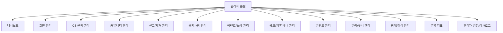

# 01. 관리자 기능 기획서 최종본

---

## 문서 통제 정보

| 항목        | 내용                                                                                   |
| ----------- | -------------------------------------------------------------------------------------- |
| 프로젝트    | 급여납치 Salary Hijacking 플랫폼                                                       |
| 문서 상태   | 문서상·이론상 최종본                                                                   |
| 기준일      | 2026-06-15                                                                             |
| 적용 범위   | 모바일 앱, API 서버, Neon DB, Cloudflare, GitHub 기반 운영 환경                        |
| 핵심 도메인 | 급여 관리, 예산 관리, 지출 기록, 레벨업, 커뮤니티, 알림, 광고/제휴, 관리자 운영        |
| 운영 기준   | 사용자의 급여·대출·저축·소비 내역은 서비스 내부에서 고위험 재무성 개인정보로 취급한다. |
| 변경 원칙   | 본 문서의 기준 변경은 운영 책임자, 제품 책임자, 기술 책임자 승인 후 버전 관리한다.     |

---

## 1. 문서 목적

본 문서는 급여납치 플랫폼의 관리자 콘솔에서 제공해야 하는 모든 기능을 정의한다. 관리자 콘솔은 사용자 지원, 커뮤니티 품질 관리, 공지 운영, 광고/제휴 운영, 이벤트 운영, 장애 대응, 운영 지표 확인을 수행하는 내부 운영 시스템이다.

## 2. 관리자 콘솔 목표

| 목표             | 설명                                                    | 성공 기준                                        |
| ---------------- | ------------------------------------------------------- | ------------------------------------------------ |
| 운영 효율화      | 반복 문의, 신고, 공지, 배너 등록을 관리자 화면에서 처리 | 운영자가 개발자 개입 없이 표준 업무 처리         |
| 사용자 보호      | 급여·소비·저축 관련 데이터 접근을 최소화                | 민감 데이터 조회 권한 분리 및 감사로그 100% 기록 |
| 커뮤니티 안정화  | 신고, 숨김, 삭제, 제재를 정책 기준으로 처리             | 신고 SLA 준수율 95% 이상                         |
| 서비스 신뢰 확보 | 공지, 장애, 이벤트, 약관 변경을 투명하게 전달           | 주요 공지 누락 0건                               |
| 수익화 관리      | 광고/제휴 배너 노출과 로그 확인                         | 소재 승인, 노출, 클릭, 종료 관리 가능            |

## 3. 관리자 역할 및 권한

| 역할 ID       | 역할명           | 권한 범위                              | 제한 사항                                |
| ------------- | ---------------- | -------------------------------------- | ---------------------------------------- |
| ADM-OWNER     | 최고 관리자      | 모든 메뉴, 권한 부여, 시스템 설정      | 최소 2인 승인 대상 작업은 단독 처리 금지 |
| ADM-OPS       | 운영 관리자      | 회원 상태, CS, 공지, 이벤트, 신고 처리 | 급여 상세 금액 직접 조회 금지            |
| ADM-COMMUNITY | 커뮤니티 관리자  | 게시글/댓글/신고/제재 관리             | 회원 재무 데이터 접근 금지               |
| ADM-CONTENT   | 콘텐츠 관리자    | 독서/뉴스/영어/건강 콘텐츠 관리        | 회원 계정 제재 권한 없음                 |
| ADM-AD        | 광고/제휴 관리자 | 광고 소재, 캠페인, 노출 위치 관리      | 사용자 재무 데이터 기반 타겟팅 금지      |
| ADM-CS        | CS 담당자        | 문의 조회/답변, 제한적 계정 상태 확인  | 개인정보 원문 조회 제한                  |
| ADM-READONLY  | 조회 전용        | 운영 대시보드 조회                     | 수정/삭제/다운로드 금지                  |
| ADM-AUDITOR   | 감사 담당        | 감사로그, 접근로그, 변경 이력 조회     | 운영 데이터 수정 금지                    |

## 4. 관리자 메뉴 구조

## 5. 기능 목록

| 기능 ID    | 기능명                  | 설명                                           | 우선순위 | 권한                   |
| ---------- | ----------------------- | ---------------------------------------------- | -------- | ---------------------- |
| ADM-FN-001 | 관리자 로그인           | 관리자 전용 로그인, MFA, 세션 관리             | P1       | 전체 관리자            |
| ADM-FN-002 | 관리자 권한 관리        | 역할 생성, 권한 부여, 회수                     | P1       | ADM-OWNER              |
| ADM-FN-003 | 회원 검색               | userId, 닉네임, 이메일 해시, 가입일 기준 검색  | P1       | ADM-OPS, ADM-CS        |
| ADM-FN-004 | 회원 상태 변경          | 정상, 휴면, 정지, 탈퇴대기, 탈퇴완료 상태 관리 | P1       | ADM-OPS                |
| ADM-FN-005 | 민감 데이터 마스킹 조회 | 급여/소비/저축 정보 마스킹 조회                | P1       | ADM-OPS 제한           |
| ADM-FN-006 | CS 문의 처리            | 문의 분류, 답변, 상태 변경, 내부 메모          | P1       | ADM-CS, ADM-OPS        |
| ADM-FN-007 | 게시글 관리             | 게시글 조회, 숨김, 삭제, 복구, 고정            | P1       | ADM-COMMUNITY          |
| ADM-FN-008 | 댓글 관리               | 댓글 숨김, 삭제, 복구                          | P1       | ADM-COMMUNITY          |
| ADM-FN-009 | 신고 처리               | 신고 접수, 검토, 조치, 반려, 이력 관리         | P1       | ADM-COMMUNITY          |
| ADM-FN-010 | 사용자 제재             | 경고, 작성 제한, 이용 정지, 영구 정지          | P1       | ADM-OPS, ADM-COMMUNITY |
| ADM-FN-011 | 공지 등록               | 점검, 업데이트, 이벤트, 정책 변경 공지 등록    | P1       | ADM-OPS                |
| ADM-FN-012 | 푸시 발송               | 타깃 조건 없는 전체/세그먼트 푸시 발송         | P2       | ADM-OPS                |
| ADM-FN-013 | 이벤트 관리             | 이벤트 생성, 기간, 조건, 보상, 당첨자 관리     | P2       | ADM-OPS                |
| ADM-FN-014 | 보상 지급/회수          | 포인트/배지/경험치 지급 및 회수                | P2       | ADM-OPS                |
| ADM-FN-015 | 광고 배너 관리          | 소재 등록, 위치, 기간, 랜딩 URL, 노출 상태     | P2       | ADM-AD                 |
| ADM-FN-016 | 제휴사 관리             | 제휴사 정보, 캠페인, 정산 기준 관리            | P3       | ADM-AD                 |
| ADM-FN-017 | 콘텐츠 관리             | 독서/뉴스/영어/건강 콘텐츠 등록/수정/중단      | P2       | ADM-CONTENT            |
| ADM-FN-018 | 운영 지표 조회          | DAU, WAU, 지출 기록 수, 게시글 수 등 확인      | P1       | ADM-READONLY 이상      |
| ADM-FN-019 | 장애 공지 관리          | 장애 배너, 점검 안내, 복구 공지                | P1       | ADM-OPS                |
| ADM-FN-020 | 감사로그 조회           | 관리자 행위 로그 조회 및 다운로드              | P1       | ADM-AUDITOR, ADM-OWNER |

## 6. 회원 관리 상세

### 6.1 회원 목록 컬럼

| 컬럼          | 설명                         | 노출 방식                       |
| ------------- | ---------------------------- | ------------------------------- |
| userId        | 내부 회원 식별자             | 전체 노출                       |
| 닉네임        | 사용자 표시명                | 전체 노출                       |
| 이메일        | 로그인 식별자                | 마스킹, 예: ki\*\*\*@domain.com |
| 가입 방식     | 이메일, 네이버, 카카오, 구글 | 전체 노출                       |
| 가입일        | 최초 가입 시각               | 전체 노출                       |
| 최근 접속     | 마지막 앱 접속 시각          | 전체 노출                       |
| 상태          | 정상, 정지, 탈퇴대기 등      | 전체 노출                       |
| 레벨          | 현재 레벨                    | 전체 노출                       |
| 누적 납치금액 | 재무성 데이터                | 기본 마스킹, 권한자만 일부 조회 |
| 신고 누적     | 커뮤니티 신고 수             | 운영 권한 노출                  |

### 6.2 금지 작업

- 관리자는 사용자의 비밀번호 원문을 조회할 수 없다.
- 관리자는 사용자의 급여 원문을 업무 목적 없이 조회할 수 없다.
- 관리자는 사용자의 대출, 저축, 소비 내역을 광고/제휴 목적으로 조회하거나 추출할 수 없다.
- 관리자는 사용자 계정으로 대리 로그인할 수 없다.
- 데이터 수정 요청은 CS 티켓과 변경 사유가 있어야 한다.

## 7. 게시글/댓글 관리 상세

| 조치     | 의미                      | 사용자 노출                  | 복구 가능 여부 | 감사로그 |
| -------- | ------------------------- | ---------------------------- | -------------- | -------- |
| 숨김     | 목록/상세에서 임시 비노출 | “운영 정책에 따라 숨김 처리” | 가능           | 필수     |
| 삭제     | 운영 정책 위반으로 삭제   | 삭제 안내                    | 제한적 가능    | 필수     |
| 고정     | 공지성/우수 글 상단 노출  | 상단 노출                    | 가능           | 필수     |
| 블라인드 | 신고 누적 임시 차단       | 검토 중 표시                 | 가능           | 필수     |
| 복구     | 숨김/삭제 조치 해제       | 정상 노출                    | 해당 없음      | 필수     |

## 8. 신고/제재 관리 상세

| 신고 유형     | 예시                           | 1차 조치  | 2차 조치  | 최종 조치      |
| ------------- | ------------------------------ | --------- | --------- | -------------- |
| 욕설/비방     | 인신공격, 혐오 표현            | 숨김 검토 | 경고      | 이용 제한      |
| 개인정보 노출 | 전화번호, 계좌, 회사 실명 악용 | 즉시 숨김 | 삭제      | 계정 제한      |
| 금융 오정보   | 확정 수익 보장, 불법 투자 권유 | 숨김      | 삭제      | 영구 정지 가능 |
| 광고/스팸     | 반복 홍보, 외부 링크 유도      | 삭제      | 작성 제한 | 정지           |
| 음란/불법     | 불법 촬영, 성적 콘텐츠         | 즉시 삭제 | 계정 정지 | 영구 정지      |
| 자해/위험     | 자해 조장, 위험 행위 조장      | 숨김      | 도움 안내 | 계정 보호 조치 |

## 9. 공지 관리 상세

| 공지 유형   | 사용 위치         | 필수 입력값                     | 승인                  |
| ----------- | ----------------- | ------------------------------- | --------------------- |
| 일반 공지   | 공지사항 목록     | 제목, 본문, 게시 기간           | 운영 관리자           |
| 긴급 공지   | 앱 상단 배너/푸시 | 장애 내용, 영향 범위, 조치 상황 | 운영+기술 책임자      |
| 점검 공지   | 앱 진입/공지      | 점검 시간, 영향 기능            | 운영+기술 책임자      |
| 정책 변경   | 공지/이메일/푸시  | 변경 전후, 시행일, 문의처       | 운영+법무/정책 책임자 |
| 이벤트 공지 | 홈/알림/공지      | 기간, 조건, 보상, 유의사항      | 운영 책임자           |

## 10. 광고/배너 관리 상세

| 항목      | 기준                                                |
| --------- | --------------------------------------------------- |
| 배너 위치 | 홈 상단/중간, LV UP, 마이페이지, 커뮤니티 목록 사이 |
| 소재 형식 | 이미지, 텍스트, 랜딩 URL, CTA                       |
| 심사 기준 | 불법/과장/오인 광고 금지, 금융성 표현 검수          |
| 노출 제어 | 기간, 위치, 우선순위, 노출 빈도, 상태               |
| 로그      | impression, click, close, landing_success           |
| 금지      | 급여·대출·저축 원문 데이터 기반 타겟팅              |

## 11. 감사로그 요구사항

| 로그 항목      | 필수 여부                                     |
| -------------- | --------------------------------------------- |
| 관리자 ID      | 필수                                          |
| 관리자 역할    | 필수                                          |
| 대상 리소스 ID | 필수                                          |
| 작업 유형      | 필수                                          |
| 변경 전 값     | 가능하면 필수, 민감정보는 마스킹              |
| 변경 후 값     | 가능하면 필수, 민감정보는 마스킹              |
| 사유           | 회원 상태 변경, 삭제, 제재, 보상 회수 시 필수 |
| IP/기기        | 필수                                          |
| 처리 시각      | 필수                                          |

## 12. 관리자 화면별 수락 기준

| 화면          | 완료 기준                                               |
| ------------- | ------------------------------------------------------- |
| 관리자 로그인 | MFA, 세션 만료, 실패 제한, 감사로그가 작동한다.         |
| 회원 관리     | 검색, 필터, 상태 변경, 마스킹, 로그 기록이 가능하다.    |
| CS 관리       | 문의 접수, 배정, 답변, 상태 변경, 내부 메모가 가능하다. |
| 커뮤니티 관리 | 게시글/댓글 숨김, 삭제, 복구, 고정이 가능하다.          |
| 신고 관리     | 신고 유형별 검토, 조치, 반려, 제재 연결이 가능하다.     |
| 공지 관리     | 예약 게시, 즉시 게시, 종료, 푸시 연동이 가능하다.       |
| 이벤트 관리   | 조건 생성, 보상 지급, 중복 방지, 회수 처리가 가능하다.  |
| 광고 관리     | 소재 승인, 노출 제어, 클릭 로그 확인이 가능하다.        |
| 콘텐츠 관리   | 콘텐츠 등록, 수정, 중단, 노출 순서 변경이 가능하다.     |
| 운영 지표     | 주요 KPI를 기간별로 조회하고 CSV 내보내기가 가능하다.   |

## 13. 완료 선언

본 문서는 급여납치 관리자 기능의 문서상·이론상 최종 구현 기준이다. 본 문서에 정의된 메뉴, 권한, 기능, 감사로그, 수락 기준을 충족하면 관리자 운영툴은 최종 완료 상태로 판정한다.
