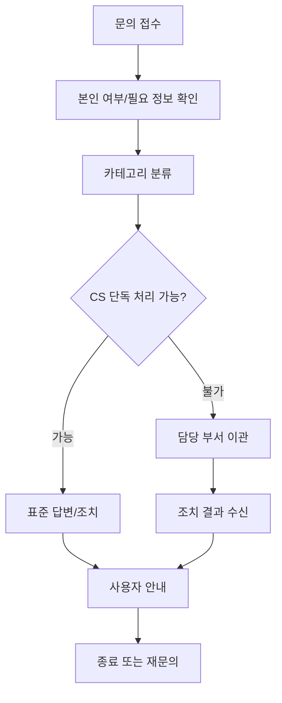

# 02. CS 운영 매뉴얼 최종본

---

## 문서 통제 정보

| 항목        | 내용                                                                                   |
| ----------- | -------------------------------------------------------------------------------------- |
| 프로젝트    | 급여납치 Salary Hijacking 플랫폼                                                       |
| 문서 상태   | 문서상·이론상 최종본                                                                   |
| 기준일      | 2026-06-15                                                                             |
| 적용 범위   | 모바일 앱, API 서버, Neon DB, Cloudflare, GitHub 기반 운영 환경                        |
| 핵심 도메인 | 급여 관리, 예산 관리, 지출 기록, 레벨업, 커뮤니티, 알림, 광고/제휴, 관리자 운영        |
| 운영 기준   | 사용자의 급여·대출·저축·소비 내역은 서비스 내부에서 고위험 재무성 개인정보로 취급한다. |
| 변경 원칙   | 본 문서의 기준 변경은 운영 책임자, 제품 책임자, 기술 책임자 승인 후 버전 관리한다.     |

---

## 1. 목적

본 문서는 급여납치 고객센터가 사용자 문의, 신고, 데이터 삭제, 알림 오류, 계정 문제, 커뮤니티 문제, 이벤트/보상 문제를 일관된 기준으로 처리하기 위한 최종 운영 매뉴얼이다.

## 2. CS 운영 원칙

1. 사용자의 급여·대출·저축·소비 내역은 원문 확인을 최소화하고, 필요한 경우에도 마스킹된 정보로 처리한다.
2. 모든 문의는 티켓 ID를 부여하고 처리 상태를 기록한다.
3. 개인정보 삭제, 계정 탈퇴, 금전성 보상, 제재 이의제기는 일반 문의보다 우선 처리한다.
4. 정책 판단이 필요한 문의는 임의 답변하지 않고 담당 권한자에게 에스컬레이션한다.
5. 사용자에게 안내하는 문구는 FAQ, 약관, 개인정보처리방침, 공지사항과 일치해야 한다.

## 3. CS 티켓 상태값

| 상태         | 의미                              | 다음 가능 상태               |
| ------------ | --------------------------------- | ---------------------------- |
| 접수         | 사용자가 문의를 제출함            | 분류완료, 추가정보요청       |
| 분류완료     | 담당 카테고리가 지정됨            | 처리중, 이관                 |
| 처리중       | 담당자가 확인 중                  | 답변완료, 추가정보요청, 이관 |
| 추가정보요청 | 사용자 정보가 부족함              | 처리중, 자동종료             |
| 답변완료     | 1차 답변 완료                     | 재문의, 종료                 |
| 이관         | 기술/정책/보안/운영 담당에게 전달 | 처리중, 답변완료             |
| 보류         | 외부 확인 또는 배포 대기          | 처리중, 답변완료             |
| 종료         | 최종 처리 완료                    | 재오픈                       |

## 4. 문의 카테고리

| 대분류    | 소분류                                       | 우선순위 | 담당           |
| --------- | -------------------------------------------- | -------- | -------------- |
| 계정      | 로그인 실패, 소셜 로그인, 비밀번호, 탈퇴     | P1~P2    | CS/인증 담당   |
| 급여/지출 | 급여 입력, 계산 오류, 지출 수정, 데이터 삭제 | P1~P2    | CS/제품 담당   |
| 알림      | 푸시 미수신, 중복 알림, 잘못된 알림          | P2       | CS/백엔드 담당 |
| 커뮤니티  | 신고, 삭제 문의, 제재 이의, 익명글           | P1~P3    | 커뮤니티 운영  |
| 이벤트    | 보상 미지급, 조건 문의, 부정 참여            | P2       | 이벤트 운영    |
| 광고/제휴 | 광고 신고, 부적절 광고, 랜딩 오류            | P2~P3    | 광고 운영      |
| 개인정보  | 열람, 정정, 삭제, 처리정지                   | P0~P1    | 개인정보 담당  |
| 장애      | 앱 접속 불가, API 오류, 데이터 불일치        | P0~P1    | 기술/운영      |

## 5. SLA 기준

| 우선순위 | 정의                                  |     1차 응답 |         해결 목표 | 예시                          |
| -------- | ------------------------------------- | -----------: | ----------------: | ----------------------------- |
| P0       | 서비스 전체 장애, 개인정보 유출 의심  |    30분 이내 | 당일 내 복구/공지 | 로그인 전체 불가, 데이터 노출 |
| P1       | 핵심 기능 사용 불가, 데이터 삭제 요청 |   4시간 이내 |      1영업일 이내 | 급여 저장 불가, 탈퇴 처리     |
| P2       | 주요 기능 오류, 보상/알림 문제        | 1영업일 이내 |      3영업일 이내 | 알림 미수신, 포인트 미지급    |
| P3       | 일반 문의, 사용법 문의                | 2영업일 이내 |      5영업일 이내 | 납치금액 의미, FAQ성 문의     |

## 6. 표준 처리 절차

## 7. 주요 문의별 대응 매뉴얼

### 7.1 로그인 문제

| 증상               | 확인 항목                                  | 조치                 | 사용자 안내                                           |
| ------------------ | ------------------------------------------ | -------------------- | ----------------------------------------------------- |
| 이메일 로그인 실패 | 이메일 형식, 계정 상태, 비밀번호 실패 횟수 | 비밀번호 재설정 안내 | “비밀번호 재설정을 진행해주세요.”                     |
| 소셜 로그인 실패   | 제공자, 연결 계정, 탈퇴 이력               | 소셜 재연결 안내     | “기존에 가입한 로그인 방식을 선택해주세요.”           |
| 계정 정지          | 제재 이력, 사유                            | 이의제기 절차 안내   | “운영 정책 위반 여부를 재검토해드리겠습니다.”         |
| 탈퇴 후 재가입     | 탈퇴 완료일, 재가입 제한 여부              | 정책 기준 확인       | “탈퇴 처리 후 일부 데이터는 즉시 복구할 수 없습니다.” |

### 7.2 급여 데이터 삭제 요청

1. 사용자 본인 인증을 확인한다.
2. 삭제 대상 범위를 확인한다: 급여계획, 지출내역, 저축계획, 전체 계정.
3. 삭제 후 복구 불가 항목을 안내한다.
4. 관리자 콘솔에서 삭제 요청 티켓을 생성한다.
5. 삭제 처리 후 결과를 사용자에게 안내한다.
6. 개인정보 요청 처리 이력을 남긴다.

### 7.3 게시글 신고

| 단계 | 처리 내용                               |
| ---- | --------------------------------------- |
| 1    | 신고 대상 게시글/댓글 ID 확인           |
| 2    | 신고 유형 분류                          |
| 3    | 정책 위반 여부 검토                     |
| 4    | 숨김/삭제/반려/제재 결정                |
| 5    | 신고자에게 처리 결과 안내               |
| 6    | 피신고자에게 필요한 경우 조치 사유 안내 |

### 7.4 알림 오류

| 오류           | 확인 항목                     | 조치                             |
| -------------- | ----------------------------- | -------------------------------- |
| 푸시 미수신    | 앱 권한, 기기 토큰, 알림 설정 | 권한 재설정 안내, 토큰 갱신 요청 |
| 중복 알림      | 발송 로그, 스케줄러 중복 실행 | 중복 배치 중단, 재발 방지 등록   |
| 잘못된 알림    | 알림 조건, 대상자 세그먼트    | 발송 취소 또는 정정 공지         |
| 읽음 처리 불가 | API 응답, 네트워크 오류       | 재시도 안내, 오류 로그 확인      |

### 7.5 이벤트 보상 미지급

1. 이벤트 ID와 참여 계정을 확인한다.
2. 이벤트 조건 충족 여부를 로그로 확인한다.
3. 중복 지급 여부를 확인한다.
4. 정상 미지급이면 수동 지급한다.
5. 조건 미충족이면 기준을 안내한다.
6. 부정 참여 의심이면 이벤트 운영 담당자에게 이관한다.

## 8. 금지 답변

| 금지 표현               | 대체 표현                                                 |
| ----------------------- | --------------------------------------------------------- |
| “시스템상 안 됩니다.”   | “현재 확인한 결과, 해당 기능은 정책상 지원되지 않습니다.” |
| “저희 책임이 아닙니다.” | “확인 가능한 범위에서 원인을 검토하겠습니다.”             |
| “개발팀에 물어보세요.”  | “기술 담당 부서에 이관해 확인하겠습니다.”                 |
| “복구 가능합니다.”      | “복구 가능 여부를 확인한 뒤 안내드리겠습니다.”            |
| “투자하셔도 됩니다.”    | “급여납치의 콘텐츠는 투자 조언이 아닙니다.”               |

## 9. 표준 답변 템플릿

### 9.1 급여 입력 방법

안녕하세요. 급여납치 고객센터입니다.  
급여 입력은 `계획 > 급여 계획/설정`에서 수령 예정 급여, 급여일, 예상 지출금액을 입력한 뒤 저장하면 됩니다. 저장 후 홈 화면에서 수령금액, 지출금액, 납치금액이 자동 계산됩니다.

### 9.2 지출 삭제/수정

안녕하세요. 급여납치 고객센터입니다.  
변동지출 내역은 `급여 홈 > 금일 변동 지출`에서 항목을 선택해 수정하거나 삭제할 수 있습니다. 삭제 시 오늘 사용금액과 남은금액이 즉시 재계산됩니다.

### 9.3 개인정보 삭제

안녕하세요. 급여납치 고객센터입니다.  
개인정보 삭제 요청은 본인 확인 후 처리됩니다. 삭제 범위에 따라 일부 데이터는 복구가 불가능하므로, 삭제 대상이 급여계획/지출내역/계정 전체 중 무엇인지 확인해 주세요.

### 9.4 게시글 신고

안녕하세요. 급여납치 고객센터입니다.  
신고해주신 게시글은 커뮤니티 운영 정책에 따라 검토됩니다. 정책 위반으로 확인되면 숨김, 삭제, 작성 제한 등의 조치가 적용될 수 있습니다.

## 10. 에스컬레이션 기준

| 이관 대상     | 이관 조건                                             |
| ------------- | ----------------------------------------------------- |
| 기술 담당     | API 오류, 앱 충돌, 데이터 계산 불일치, 푸시 발송 실패 |
| 개인정보 담당 | 열람/삭제/정정/처리정지, 유출 의심, 제3자 제공 문의   |
| 커뮤니티 운영 | 신고, 제재 이의, 반복 악성 사용자                     |
| 이벤트 운영   | 보상 누락, 부정 참여, 대량 지급 오류                  |
| 광고 운영     | 부적절 광고, 광고 랜딩 오류, 제휴 문의                |
| 운영 책임자   | 언론 문의, 대량 장애, 정책 해석 필요                  |

## 11. CS 품질 지표

| 지표            | 산식                             |     목표 |
| --------------- | -------------------------------- | -------: |
| 1차 응답 준수율 | SLA 내 1차 응답 건수 / 전체 문의 | 95% 이상 |
| 해결 준수율     | SLA 내 해결 건수 / 전체 문의     | 90% 이상 |
| 재문의율        | 동일 이슈 재문의 / 전체 문의     | 10% 이하 |
| 만족도          | 긍정 평가 / 평가 응답            | 85% 이상 |
| 이관 정확도     | 올바른 부서 이관 / 전체 이관     | 95% 이상 |

## 12. 완료 선언

본 문서는 급여납치 고객센터 운영의 문서상·이론상 최종 기준이다. 본 매뉴얼의 카테고리, SLA, 절차, 템플릿, 이관 기준을 적용하면 CS 운영은 최종 완료 상태로 판정한다.
