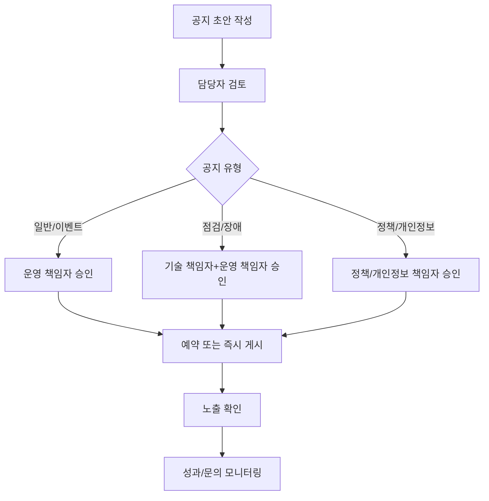

# 04. 공지사항 운영 가이드 최종본

---

## 문서 통제 정보

| 항목        | 내용                                                                                   |
| ----------- | -------------------------------------------------------------------------------------- |
| 프로젝트    | 급여납치 Salary Hijacking 플랫폼                                                       |
| 문서 상태   | 문서상·이론상 최종본                                                                   |
| 기준일      | 2026-06-15                                                                             |
| 적용 범위   | 모바일 앱, API 서버, Neon DB, Cloudflare, GitHub 기반 운영 환경                        |
| 핵심 도메인 | 급여 관리, 예산 관리, 지출 기록, 레벨업, 커뮤니티, 알림, 광고/제휴, 관리자 운영        |
| 운영 기준   | 사용자의 급여·대출·저축·소비 내역은 서비스 내부에서 고위험 재무성 개인정보로 취급한다. |
| 변경 원칙   | 본 문서의 기준 변경은 운영 책임자, 제품 책임자, 기술 책임자 승인 후 버전 관리한다.     |

---

## 1. 목적

본 문서는 급여납치 앱 내 공지사항, 긴급 배너, 푸시 공지, 이메일/문자 공지의 운영 기준을 정의한다. 점검, 업데이트, 이벤트, 정책 변경, 장애, 개인정보 관련 고지를 사용자에게 정확하고 일관되게 전달하는 것을 목적으로 한다.

## 2. 공지 유형

| 공지 유형      | 목적                        | 노출 위치                  | 승인자           | 발송 수단       |
| -------------- | --------------------------- | -------------------------- | ---------------- | --------------- |
| 일반 공지      | 서비스 안내                 | 공지사항 목록              | 운영 관리자      | 앱 내 공지      |
| 업데이트 공지  | 버전 변경 안내              | 공지사항, 앱 업데이트 화면 | 제품 책임자      | 앱 내 공지/푸시 |
| 점검 공지      | 예정된 서비스 중단 안내     | 앱 상단, 공지사항          | 기술+운영 책임자 | 앱 내 공지/푸시 |
| 긴급 장애 공지 | 장애 발생 및 복구 안내      | 앱 상단 긴급 배너          | 운영 책임자      | 앱 배너/푸시    |
| 이벤트 공지    | 참여 조건 및 보상 안내      | 홈, 알림, 공지사항         | 이벤트 운영      | 앱 내 공지/푸시 |
| 정책 변경 공지 | 약관/개인정보/운영정책 변경 | 공지사항, 이메일, 푸시     | 정책 책임자      | 앱/이메일/푸시  |
| 보안 공지      | 보안 조치/비밀번호 변경 등  | 앱, 이메일                 | 보안 책임자      | 앱/이메일/푸시  |

## 3. 공지 작성 원칙

1. 제목만으로도 사용자 영향 범위가 이해되어야 한다.
2. 공지 본문에는 변경/장애/점검의 원인보다 사용자에게 필요한 행동을 먼저 쓴다.
3. 날짜와 시간은 한국시간 기준으로 표기한다.
4. 금액, 보상, 정책 변경은 조건과 예외를 명확히 적는다.
5. 장애 공지는 확인 중이라도 사실만 공개하고 추정 원인을 단정하지 않는다.
6. 개인정보/보안 공지는 축소 표현 없이 영향 범위와 조치 방법을 안내한다.

## 4. 공지 필수 입력값

| 필드           | 설명                                 | 필수 |
| -------------- | ------------------------------------ | ---- |
| noticeId       | 공지 식별자                          | 필수 |
| noticeType     | 일반, 점검, 장애, 이벤트, 정책, 보안 | 필수 |
| title          | 제목                                 | 필수 |
| summary        | 목록용 요약                          | 필수 |
| body           | 본문                                 | 필수 |
| startAt        | 노출 시작 시각                       | 필수 |
| endAt          | 노출 종료 시각                       | 선택 |
| target         | 전체, OS, 버전, 회원 상태            | 필수 |
| priority       | 일반, 중요, 긴급                     | 필수 |
| needPush       | 푸시 여부                            | 필수 |
| approvalStatus | 초안, 승인대기, 승인, 반려, 게시     | 필수 |

## 5. 공지 승인 프로세스



## 6. 공지 템플릿

### 6.1 점검 공지

```markdown
# [점검 안내] 급여납치 서비스 점검 안내

안녕하세요. 급여납치입니다.
더 안정적인 서비스 제공을 위해 아래 시간 동안 서비스 점검이 진행됩니다.

- 점검 일시: YYYY년 MM월 DD일 HH:MM ~ HH:MM
- 영향 범위: 앱 접속, 급여 홈, 지출 기록, 커뮤니티 이용 제한
- 사용자 조치: 점검 시간 이후 다시 접속해 주세요.

점검이 완료되면 본 공지를 통해 안내드리겠습니다.
```

### 6.2 업데이트 공지

```markdown
# [업데이트] 급여납치 vX.X.X 업데이트 안내

이번 업데이트에는 다음 내용이 포함됩니다.

1. 급여 계획 입력 화면 개선
2. 변동지출 수정 기능 안정화
3. 알림 수신 설정 개선
4. 알려진 오류 수정

원활한 이용을 위해 최신 버전으로 업데이트해 주세요.
```

### 6.3 이벤트 공지

```markdown
# [이벤트] 이번 달 납치금액 목표 달성 이벤트

이벤트 기간 동안 목표 납치금액을 달성하면 보상이 지급됩니다.

- 기간: YYYY.MM.DD ~ YYYY.MM.DD
- 참여 조건: 이벤트 기간 내 목표 납치금액 달성
- 보상: 포인트/배지/경험치
- 지급일: 조건 달성 후 N일 이내
- 유의사항: 부정 참여 또는 중복 계정 사용 시 보상이 회수될 수 있습니다.
```

### 6.4 정책 변경 공지

```markdown
# [정책 변경] 급여납치 서비스 이용약관 변경 안내

급여납치 서비스 이용약관이 아래와 같이 변경됩니다.

- 시행일: YYYY년 MM월 DD일
- 주요 변경 내용:
  1. 커뮤니티 운영 기준 구체화
  2. 이벤트 보상 회수 기준 추가
  3. 광고/제휴 콘텐츠 표시 기준 명확화

변경 내용에 동의하지 않는 경우 시행일 전까지 회원 탈퇴를 요청할 수 있습니다.
```

### 6.5 장애 공지

```markdown
# [장애 안내] 일부 기능 이용 지연 안내

현재 일부 사용자에게 급여 홈 또는 커뮤니티 화면 로딩 지연이 발생하고 있습니다.

- 발생 시각: YYYY년 MM월 DD일 HH:MM
- 영향 범위: 급여 홈/커뮤니티 일부 기능
- 현재 상태: 원인 확인 및 복구 진행 중
- 사용자 조치: 복구 완료 후 다시 안내드리겠습니다.

이용에 불편을 드려 죄송합니다.
```

## 7. 공지 우선순위

| 우선순위 | 적용 상황                                | 노출 방식                       |
| -------- | ---------------------------------------- | ------------------------------- |
| 긴급     | 서비스 중단, 개인정보, 보안, 대규모 오류 | 앱 상단 고정, 푸시, 이메일 가능 |
| 중요     | 점검, 정책 변경, 주요 업데이트           | 공지 상단, 푸시 선택            |
| 일반     | 기능 안내, 콘텐츠 안내                   | 공지 목록 노출                  |
| 마케팅   | 이벤트, 제휴, 광고성 안내                | 수신 동의자 대상 노출           |

## 8. 공지 검수 체크리스트

| 항목                                        | 체크 |
| ------------------------------------------- | ---- |
| 제목이 사용자 영향 범위를 명확히 설명하는가 | ☐    |
| 날짜와 시간이 정확한가                      | ☐    |
| 영향 기능이 구체적으로 적혀 있는가          | ☐    |
| 사용자가 해야 할 행동이 있는가              | ☐    |
| 보상/이벤트 조건이 모호하지 않은가          | ☐    |
| 법적/정책 변경은 시행일과 문의처가 있는가   | ☐    |
| 광고성 공지는 수신 동의자 기준을 지키는가   | ☐    |
| 푸시 발송 대상이 정확한가                   | ☐    |
| 오탈자와 링크 오류가 없는가                 | ☐    |

## 9. 공지 성과 지표

| 지표               | 의미                                 |
| ------------------ | ------------------------------------ |
| 공지 조회수        | 공지 상세 조회 수                    |
| 푸시 오픈율        | 푸시 수신 대비 클릭 비율             |
| 공지 후 문의량     | 공지 관련 CS 문의 건수               |
| 이벤트 참여 전환율 | 이벤트 공지 조회 후 참여 비율        |
| 장애 공지 응답시간 | 장애 감지 후 최초 공지까지 걸린 시간 |

## 10. 완료 선언

본 문서는 급여납치 공지사항 운영의 문서상·이론상 최종 기준이다. 본 기준에 따라 공지를 작성, 승인, 게시, 측정하면 공지 운영은 최종 완료 상태로 판정한다.
