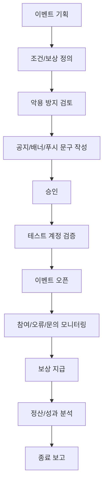

# 05. 이벤트 운영 기획서 최종본

---

## 문서 통제 정보

| 항목        | 내용                                                                                   |
| ----------- | -------------------------------------------------------------------------------------- |
| 프로젝트    | 급여납치 Salary Hijacking 플랫폼                                                       |
| 문서 상태   | 문서상·이론상 최종본                                                                   |
| 기준일      | 2026-06-15                                                                             |
| 적용 범위   | 모바일 앱, API 서버, Neon DB, Cloudflare, GitHub 기반 운영 환경                        |
| 핵심 도메인 | 급여 관리, 예산 관리, 지출 기록, 레벨업, 커뮤니티, 알림, 광고/제휴, 관리자 운영        |
| 운영 기준   | 사용자의 급여·대출·저축·소비 내역은 서비스 내부에서 고위험 재무성 개인정보로 취급한다. |
| 변경 원칙   | 본 문서의 기준 변경은 운영 책임자, 제품 책임자, 기술 책임자 승인 후 버전 관리한다.     |

---

## 1. 목적

본 문서는 급여납치 플랫폼의 이벤트와 보상 운영 기준을 정의한다. 이벤트는 사용자의 급여 계획 등록, 지출 기록, 목표 달성, 레벨업 미션, 커뮤니티 인증을 촉진하는 수단이며, 부정 참여와 보상 오류를 방지하는 구조를 포함한다.

## 2. 이벤트 운영 목표

| 목표            | 설명                                   | 대표 지표            |
| --------------- | -------------------------------------- | -------------------- |
| 초기 활성화     | 신규 사용자의 급여 계획 등록 유도      | 급여계획 등록률      |
| 습관 형성       | 일일 지출 기록과 레벨업 미션 반복 유도 | D1/D7/D30 리텐션     |
| 성취 강화       | 납치금액 목표 달성에 보상 부여         | 목표 달성률          |
| 커뮤니티 활성화 | 레벨업 인증글, 절약 후기 작성 유도     | 게시글 수, 인증글 수 |
| 수익화 연계     | 제휴 이벤트 참여 유도                  | 이벤트 참여 전환율   |

## 3. 이벤트 유형

| 이벤트 ID | 유형                 | 설명                          | 보상 예시              | 우선순위 |
| --------- | -------------------- | ----------------------------- | ---------------------- | -------- |
| EVT-001   | 신규 가입 이벤트     | 가입 후 급여계획 등록 완료    | 웰컴 배지, 경험치      | P1       |
| EVT-002   | 첫 지출 기록 이벤트  | 첫 변동지출 등록 완료         | 경험치, 포인트         | P1       |
| EVT-003   | 7일 기록 챌린지      | 7일 연속 지출 기록            | 배지, 포인트           | P1       |
| EVT-004   | 납치금액 목표 달성   | 월 목표 납치금액 달성         | 포인트, 목표 달성 배지 | P1       |
| EVT-005   | 레벨업 미션 이벤트   | 독서/뉴스/영어/건강 미션 완료 | 경험치, 레벨업 보너스  | P2       |
| EVT-006   | 커뮤니티 인증 이벤트 | 레벨업 인증글 작성            | 배지, 포인트           | P2       |
| EVT-007   | 제휴 참여 이벤트     | 광고/제휴 랜딩 참여           | 제휴 혜택              | P3       |
| EVT-008   | 복귀 이벤트          | N일 미접속 사용자 재방문      | 경험치, 알림           | P3       |

## 4. 이벤트 생성 필드

| 필드                   | 설명                                     | 필수        |
| ---------------------- | ---------------------------------------- | ----------- |
| eventId                | 이벤트 ID                                | 필수        |
| title                  | 이벤트명                                 | 필수        |
| eventType              | 신규, 기록, 목표, 레벨업, 커뮤니티, 제휴 | 필수        |
| description            | 상세 설명                                | 필수        |
| startAt/endAt          | 시작/종료 시각                           | 필수        |
| eligibility            | 참여 대상                                | 필수        |
| participationCondition | 참여 조건                                | 필수        |
| rewardType             | 포인트, 배지, 경험치, 제휴 혜택          | 필수        |
| rewardAmount           | 지급 수량                                | 조건부 필수 |
| rewardPolicy           | 지급/회수/만료 기준                      | 필수        |
| antiAbusePolicy        | 부정 참여 방지 기준                      | 필수        |
| noticeId               | 연결 공지                                | 선택        |
| status                 | 초안, 승인, 진행, 종료, 중단             | 필수        |

## 5. 이벤트 참여 조건 정의

| 조건 유형     | 판정 기준                           | 로그 기준                 |
| ------------- | ----------------------------------- | ------------------------- |
| 급여계획 등록 | PayrollPlan이 최초 생성됨           | payroll_plan_created      |
| 지출 기록     | VariableExpense가 생성됨            | expense_created           |
| 연속 기록     | N일 연속 dailyBudget.usedAmount > 0 | daily_record_streak       |
| 목표 달성     | achievementRate >= 100%             | goal_achieved             |
| 레벨업 완료   | GrowthTask completed                | growth_task_completed     |
| 인증글 작성   | CommunityPost boardType=LEVEL_CERT  | post_created              |
| 제휴 클릭     | 광고 클릭 후 랜딩 성공              | ad_click, landing_success |

## 6. 보상 정책

| 보상 유형      | 설명                   | 지급 시점            | 만료        | 회수 가능 여부    |
| -------------- | ---------------------- | -------------------- | ----------- | ----------------- |
| 경험치         | 레벨업에 반영되는 점수 | 조건 충족 즉시       | 없음        | 부정 참여 시 가능 |
| 포인트         | 이벤트성 적립값        | 조건 충족 후 N분~N일 | 정책별 설정 | 가능              |
| 배지           | 성취 표시              | 조건 충족 즉시       | 없음        | 가능              |
| 쿠폰/제휴 혜택 | 외부 제휴 보상         | 제휴사 정책 기준     | 제휴사 기준 | 제한적 가능       |

## 7. 이벤트 운영 프로세스

## 8. 악용 방지 기준

| 위험             | 방지 기준                                |
| ---------------- | ---------------------------------------- |
| 다중 계정 생성   | 동일 기기/토큰/소셜 계정 반복 참여 탐지  |
| 허위 지출 반복   | 비정상적 초단위 반복 입력 제한           |
| 인증글 도배      | 동일 내용/이미지/링크 반복 게시 제한     |
| 보상 중복 수령   | eventId+userId 기준 1회 지급 원칙        |
| 자동화 시도      | rate limit, 비정상 API 호출 탐지         |
| 제휴 이벤트 조작 | 클릭과 랜딩 성공 로그 모두 충족해야 인정 |

## 9. 이벤트별 상세 기획

### 9.1 신규 가입 급여계획 등록 이벤트

| 항목      | 내용                                        |
| --------- | ------------------------------------------- |
| 대상      | 신규 가입 후 7일 이내 사용자                |
| 조건      | 급여일, 수령 예정 급여, 목표 금액 입력 완료 |
| 보상      | 웰컴 배지 + 경험치 100                      |
| 제한      | 계정당 1회                                  |
| 성공 기준 | 신규 가입자의 급여계획 등록률 60% 이상      |

### 9.2 7일 지출 기록 챌린지

| 항목      | 내용                            |
| --------- | ------------------------------- |
| 대상      | 모든 활성 사용자                |
| 조건      | 7일 연속 변동지출 1건 이상 기록 |
| 보상      | 절약 루틴 배지 + 포인트         |
| 실패 처리 | 중간 누락 시 1일차부터 재시작   |
| 성공 기준 | 참여자의 D7 리텐션 30% 이상     |

### 9.3 월간 납치금액 목표 달성 이벤트

| 항목      | 내용                                |
| --------- | ----------------------------------- |
| 대상      | 월 목표 납치금액 설정 사용자        |
| 조건      | 월말 확정 납치금액이 목표 이상      |
| 보상      | 목표 달성 배지 + 경험치/포인트      |
| 주의      | 입력 조작이 의심되는 경우 보류 검토 |
| 성공 기준 | 목표 설정 사용자 중 달성률 25% 이상 |

## 10. 운영 모니터링 지표

| 지표               | 산식                                              |
| ------------------ | ------------------------------------------------- |
| 이벤트 노출 수     | 이벤트 페이지/배너 노출 수                        |
| 참여 시작률        | 참여 시작 사용자 / 노출 사용자                    |
| 조건 달성률        | 조건 달성 사용자 / 참여 시작 사용자               |
| 보상 지급 성공률   | 지급 성공 / 지급 대상                             |
| 부정 의심률        | 부정 의심 계정 / 참여 계정                        |
| 이벤트 후 재방문율 | 이벤트 참여 후 N일 내 재방문 사용자 / 참여 사용자 |

## 11. 보상 오류 처리

| 상황           | 처리                            |
| -------------- | ------------------------------- |
| 지급 누락      | 로그 확인 후 수동 지급          |
| 중복 지급      | 중복분 회수, 사용자 안내        |
| 조건 오판정    | 판정 로직 수정 후 대상자 재계산 |
| 부정 참여      | 보상 보류/회수, 계정 제재 가능  |
| 제휴 보상 지연 | 제휴사 확인 후 지급 예정일 안내 |

## 12. 완료 선언

본 문서는 급여납치 이벤트 운영의 문서상·이론상 최종 기준이다. 본 문서의 이벤트 유형, 조건, 보상, 악용 방지, 모니터링, 오류 처리 기준을 충족하면 이벤트 운영 체계는 최종 완료 상태로 판정한다.
