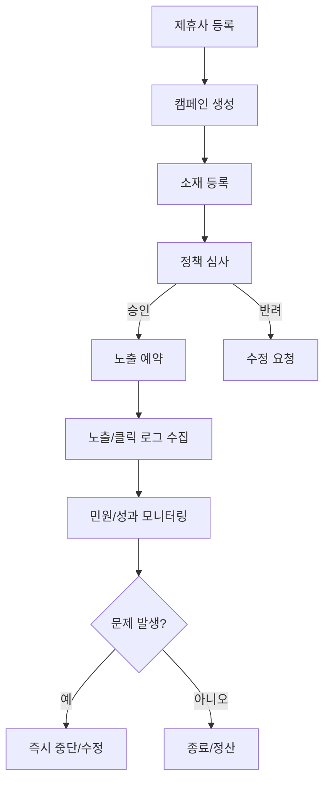

# 06. 광고/제휴 운영 문서 최종본

---

## 문서 통제 정보

| 항목        | 내용                                                                                   |
| ----------- | -------------------------------------------------------------------------------------- |
| 프로젝트    | 급여납치 Salary Hijacking 플랫폼                                                       |
| 문서 상태   | 문서상·이론상 최종본                                                                   |
| 기준일      | 2026-06-15                                                                             |
| 적용 범위   | 모바일 앱, API 서버, Neon DB, Cloudflare, GitHub 기반 운영 환경                        |
| 핵심 도메인 | 급여 관리, 예산 관리, 지출 기록, 레벨업, 커뮤니티, 알림, 광고/제휴, 관리자 운영        |
| 운영 기준   | 사용자의 급여·대출·저축·소비 내역은 서비스 내부에서 고위험 재무성 개인정보로 취급한다. |
| 변경 원칙   | 본 문서의 기준 변경은 운영 책임자, 제품 책임자, 기술 책임자 승인 후 버전 관리한다.     |

---

## 1. 목적

본 문서는 급여납치 플랫폼의 광고/제휴 배너 운영 기준을 정의한다. 광고 수익화는 사용자 신뢰를 훼손하지 않는 범위에서 운영하며, 급여·대출·저축·소비 원문 데이터는 광고 타겟팅에 사용하지 않는다.

## 2. 광고 운영 원칙

1. 광고는 명확하게 광고 또는 제휴 콘텐츠로 식별되어야 한다.
2. 급여, 대출, 저축, 소비 내역의 원문 데이터 기반 타겟팅은 금지한다.
3. 금융성 광고는 과장, 보장, 오인 표현을 금지한다.
4. 광고 랜딩 페이지는 등록 시점과 운영 중 모두 검수한다.
5. 사용자의 앱 사용 경험을 방해하는 과도한 노출은 금지한다.
6. 광고 클릭 로그는 성과 측정 목적에 한정해 보관한다.

## 3. 광고 위치

| 위치 ID     | 화면       | 위치                | 형식          | 우선순위 |
| ----------- | ---------- | ------------------- | ------------- | -------- |
| AD-HOME-001 | 급여 홈    | 급여 카드 하단 배너 | 이미지/텍스트 | P1       |
| AD-HOME-002 | 급여 홈    | 지출 리스트 사이    | 네이티브 카드 | P2       |
| AD-LV-001   | LV UP      | 상단 배너           | 이미지/텍스트 | P2       |
| AD-COMM-001 | 커뮤니티   | 게시글 목록 중간    | 네이티브 카드 | P3       |
| AD-MY-001   | 마이페이지 | 메뉴 하단           | 이미지 배너   | P3       |
| AD-NOTI-001 | 알림       | 이벤트 알림 연동    | 텍스트        | P3       |

## 4. 광고 소재 필드

| 필드          | 설명                                 | 필수        |
| ------------- | ------------------------------------ | ----------- |
| adId          | 광고 ID                              | 필수        |
| partnerId     | 제휴사 ID                            | 필수        |
| campaignId    | 캠페인 ID                            | 필수        |
| title         | 광고 제목                            | 필수        |
| description   | 설명                                 | 필수        |
| imageUrl      | 이미지 소재                          | 조건부 필수 |
| landingUrl    | 랜딩 URL                             | 필수        |
| ctaText       | 버튼 문구                            | 필수        |
| placement     | 노출 위치                            | 필수        |
| startAt/endAt | 노출 기간                            | 필수        |
| frequencyCap  | 사용자별 노출 제한                   | 필수        |
| status        | 초안, 심사중, 승인, 반려, 진행, 종료 | 필수        |
| reviewMemo    | 심사 의견                            | 조건부 필수 |

## 5. 광고 심사 기준

| 항목          | 허용                        | 금지                        |
| ------------- | --------------------------- | --------------------------- |
| 금융 표현     | “혜택 확인”, “상담 신청”    | “무조건 승인”, “수익 보장”  |
| 대출 광고     | 합법 사업자, 조건 명확 표시 | 불법 사금융, 과장 금리      |
| 투자 광고     | 정보성/교육성 표현          | 원금 보장, 고수익 확정      |
| 건강 광고     | 일반 건강 정보              | 치료 효과 보장, 의학적 단정 |
| 앱/서비스     | 정상 랜딩, 개인정보 고지    | 악성앱, 피싱, 오인 유도     |
| 커뮤니티 유도 | 합법 이벤트                 | 외부 단톡방, 불법 리딩방    |

## 6. 제휴사 등록 기준

| 항목        | 기준                                            |
| ----------- | ----------------------------------------------- |
| 사업자 정보 | 사업자명, 사업자등록번호, 담당자, 연락처 보유   |
| 광고 업종   | 급여납치 정책상 허용 업종만 가능                |
| 소재 책임   | 제휴사가 제공한 문구/이미지/랜딩 법적 책임 명시 |
| 정산 방식   | CPM, CPC, CPA, 고정비 중 계약 기준 정의         |
| 개인정보    | 제휴사로 개인식별정보 전달 시 별도 동의 필요    |
| 중단 기준   | 불법/오인/민원 다발 시 즉시 중단 가능           |

## 7. 광고 노출 정책

| 정책           | 기준                                            |
| -------------- | ----------------------------------------------- |
| 빈도 제한      | 동일 캠페인 사용자당 1일 N회 이하               |
| 화면 제한      | 핵심 급여 입력 흐름 중 전면 광고 금지           |
| 아동/민감 대상 | 연령 확인이 필요한 광고는 별도 정책 전까지 금지 |
| 데이터 분리    | 급여·대출·저축·소비 원문 데이터 사용 금지       |
| 세그먼트       | 비민감 행동 데이터 기반 제한적 세그먼트 가능    |
| 사용자 제어    | 불편 광고 신고/숨김 기능 제공                   |

## 8. 광고 로그

| 이벤트          | 설명      | 필드                                    |
| --------------- | --------- | --------------------------------------- |
| ad_impression   | 광고 노출 | adId, userId_hash, placement, timestamp |
| ad_click        | 광고 클릭 | adId, userId_hash, placement, timestamp |
| ad_close        | 광고 닫기 | adId, reason, timestamp                 |
| landing_success | 랜딩 성공 | adId, campaignId, timestamp             |
| ad_report       | 광고 신고 | adId, reportType, content               |

## 9. 운영 프로세스

## 10. 광고 신고 처리

| 신고 유형     | 처리 기준                     |
| ------------- | ----------------------------- |
| 부적절한 광고 | 소재 검토 후 노출 중단 가능   |
| 과장/오인     | 문구 수정 전까지 중단         |
| 랜딩 오류     | 랜딩 복구 전까지 중단         |
| 개인정보 우려 | 제휴사 확인 및 법적 검토 이관 |
| 불법 의심     | 즉시 중단, 제휴사 소명 요청   |

## 11. 정산 기준

| 과금 방식 | 기준                | 필수 로그                             |
| --------- | ------------------- | ------------------------------------- |
| CPM       | 1,000회 노출당 과금 | ad_impression                         |
| CPC       | 클릭당 과금         | ad_click                              |
| CPA       | 전환당 과금         | landing_success 또는 제휴사 전환 로그 |
| Fixed     | 기간/위치 고정비    | 노출 기간, 위치                       |

## 12. 금지 광고 카테고리

- 불법 대출, 사금융, 고금리 불법 광고
- 원금/수익 보장 투자 광고
- 도박, 불법 사행성 서비스
- 성인/음란 콘텐츠
- 불법 의약품, 허위 건강 효과 광고
- 개인정보 탈취 가능성이 있는 랜딩
- 급여·대출 취약성을 악용하는 표현
- 커뮤니티를 외부 불법 투자/리딩방으로 유도하는 광고

## 13. 완료 선언

본 문서는 급여납치 광고/제휴 운영의 문서상·이론상 최종 기준이다. 본 문서의 광고 위치, 심사 기준, 데이터 분리, 로그, 정산, 신고 처리 기준을 충족하면 광고/제휴 운영은 최종 완료 상태로 판정한다.
