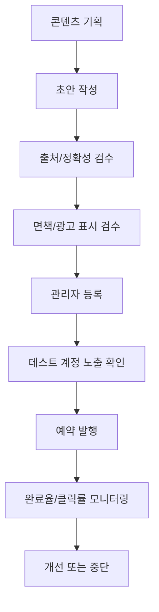

# 07. 콘텐츠 운영 가이드 최종본

---

## 문서 통제 정보

| 항목        | 내용                                                                                   |
| ----------- | -------------------------------------------------------------------------------------- |
| 프로젝트    | 급여납치 Salary Hijacking 플랫폼                                                       |
| 문서 상태   | 문서상·이론상 최종본                                                                   |
| 기준일      | 2026-06-15                                                                             |
| 적용 범위   | 모바일 앱, API 서버, Neon DB, Cloudflare, GitHub 기반 운영 환경                        |
| 핵심 도메인 | 급여 관리, 예산 관리, 지출 기록, 레벨업, 커뮤니티, 알림, 광고/제휴, 관리자 운영        |
| 운영 기준   | 사용자의 급여·대출·저축·소비 내역은 서비스 내부에서 고위험 재무성 개인정보로 취급한다. |
| 변경 원칙   | 본 문서의 기준 변경은 운영 책임자, 제품 책임자, 기술 책임자 승인 후 버전 관리한다.     |

---

## 1. 목적

본 문서는 급여납치 LV UP 영역에서 제공되는 독서, 뉴스, 영어, 건강 콘텐츠 운영 기준을 정의한다. 콘텐츠는 사용자의 자기계발 습관 형성을 돕는 보조 기능이며, 금융·투자·의료·건강 의사결정의 최종 조언으로 제공하지 않는다.

## 2. 콘텐츠 운영 원칙

1. 콘텐츠는 짧고 실행 가능해야 한다.
2. 매일 앱에 들어와 수행할 이유를 제공해야 한다.
3. 급여 관리 핵심 기능을 방해하지 않아야 한다.
4. 뉴스, 금융, 건강 콘텐츠에는 출처와 면책 안내를 제공한다.
5. 사용자 성장을 과장하지 않고 완료/누적/레벨로 성취감을 제공한다.
6. 유료 제휴 콘텐츠는 광고/제휴로 명확히 표시한다.

## 3. 콘텐츠 카테고리

| 콘텐츠 ID  | 카테고리      | 목적                           | 화면        | 보상          |
| ---------- | ------------- | ------------------------------ | ----------- | ------------- |
| CNT-BOOK   | 독서          | 기획력, 경제/경영, 사고력 향상 | 독서 레벨업 | 경험치        |
| CNT-NEWS   | 뉴스          | 경제/산업/사회/기술 흐름 파악  | 뉴스 레벨업 | 경험치        |
| CNT-ENG    | 영어          | 직장인 실무 영어 습관 형성     | 영어 레벨업 | 경험치        |
| CNT-HEALTH | 건강          | 홈트/회복/영양/정신 관리       | 건강 레벨업 | 경험치        |
| CNT-QUIZ   | 금융상식 퀴즈 | 기본 금융 이해도 강화          | 알림/레벨업 | 포인트/경험치 |

## 4. 독서 콘텐츠 운영

### 4.1 카테고리

| 카테고리  | 설명                       | 예시                      |
| --------- | -------------------------- | ------------------------- |
| AI 추천   | 사용자 레벨/관심 기준 추천 | 기획, 자기계발, 경제 입문 |
| 소설      | 몰입형 독서 습관 형성      | 단편/고전/현대소설        |
| 경제/경영 | 급여관리와 경제 이해       | 돈 관리, 조직, 마케팅     |
| 인문/철학 | 사고력, 관점 확장          | 철학, 심리, 역사          |
| 기타      | 취미/실용                  | 글쓰기, 생산성            |

### 4.2 콘텐츠 필드

| 필드      | 설명                        |
| --------- | --------------------------- |
| bookTitle | 도서명                      |
| author    | 저자                        |
| category  | 카테고리                    |
| summary   | 300자 이내 요약             |
| reason    | 추천 이유                   |
| action    | 오늘 할 행동, 예: 10분 읽기 |
| source    | 출처 또는 서지 정보         |
| rewardExp | 완료 경험치                 |

## 5. 뉴스 콘텐츠 운영

| 카테고리 | 설명                   | 금지 기준                    |
| -------- | ---------------------- | ---------------------------- |
| 경제     | 금리, 물가, 고용, 소비 | 투자 매수/매도 지시 금지     |
| 산업     | 기업/산업 트렌드       | 특정 회사 과장 홍보 금지     |
| 사회     | 생활/노동/정책 이슈    | 정치적 편향 과다 금지        |
| 기술     | AI, 앱, 보안, 생산성   | 검증되지 않은 기술 과장 금지 |
| 전체     | 주요 기사 모음         | 출처 없는 요약 금지          |

뉴스 콘텐츠는 반드시 기사 출처, 게시일, 요약, 사용자에게 필요한 관점, 면책 문구를 포함한다.

## 6. 영어 콘텐츠 운영

| 영역      | 콘텐츠 예시             | 완료 기준           |
| --------- | ----------------------- | ------------------- |
| Listening | 짧은 문장 듣기          | 1회 재생 완료       |
| Speaking  | 문장 따라 말하기        | 녹음 또는 체크 완료 |
| Reading   | 짧은 비즈니스 문장 읽기 | 문장 확인 완료      |
| Writing   | 오늘의 한 문장 작성     | 입력 완료           |

### 영어 문장 예시 구조

```text
오늘의 문장: I need to review my monthly budget.
뜻: 저는 월간 예산을 검토해야 합니다.
사용 상황: 월급 계획을 다시 확인할 때
미션: 문장을 3번 읽고 체크하기
```

## 7. 건강 콘텐츠 운영

| 영역 | 설명                 | 주의 문구                      |
| ---- | -------------------- | ------------------------------ |
| 신체 | 스트레칭, 홈트       | 통증이 있으면 즉시 중단        |
| 영양 | 물 마시기, 식단 기록 | 질환자는 전문가 상담           |
| 회복 | 수면, 휴식           | 의료 조언 아님                 |
| 정신 | 호흡, 명상, 기록     | 심각한 증상은 전문가 도움 필요 |

### 홈트 미션 예시

| 요일 | 미션                   | 시간 | 난이도 |
| ---- | ---------------------- | ---: | ------ |
| 월   | 상체 스트레칭 + 푸시업 | 10분 | 초급   |
| 화   | 하체 스쿼트 루틴       | 10분 | 초급   |
| 수   | 코어 플랭크            |  8분 | 초급   |
| 목   | 전신 유산소            | 12분 | 중급   |
| 금   | 어깨/목 회복 스트레칭  |  7분 | 초급   |
| 토   | 자유 운동 인증         | 15분 | 선택   |
| 일   | 회복/휴식 체크         |  5분 | 초급   |

## 8. 콘텐츠 검수 기준

| 항목      | 기준                                   |
| --------- | -------------------------------------- |
| 정확성    | 출처 또는 내부 기준에 따라 검증됨      |
| 실행성    | 사용자가 1~10분 안에 완료 가능         |
| 중립성    | 특정 금융상품/정치/의료 판단 강요 없음 |
| 표현      | 과장, 공포, 혐오, 차별 표현 없음       |
| 난이도    | 초급 사용자가 이해 가능                |
| 보상      | 완료 조건이 명확함                     |
| 광고 구분 | 제휴 콘텐츠는 광고 표시 필수           |

## 9. 콘텐츠 발행 프로세스



## 10. 콘텐츠 지표

| 지표           | 산식                      | 목적           |
| -------------- | ------------------------- | -------------- |
| 콘텐츠 노출 수 | 화면 노출 수              | 도달 측정      |
| 콘텐츠 클릭률  | 클릭 / 노출               | 관심도 측정    |
| 미션 완료율    | 완료 / 시작               | 실행성 측정    |
| 재방문 기여율  | 콘텐츠 완료 후 N일 재방문 | 리텐션 측정    |
| 신고/숨김률    | 신고 또는 숨김 / 노출     | 품질 위험 측정 |

## 11. 콘텐츠 중단 기준

| 상황                | 조치                   |
| ------------------- | ---------------------- |
| 출처 오류           | 즉시 중단 후 수정      |
| 금융/건강 오인 가능 | 중단 후 면책/표현 수정 |
| 신고 다발           | 검토 중 숨김           |
| 제휴 표시 누락      | 광고 중단 후 재심사    |
| 낮은 완료율 지속    | 난이도/길이 조정       |

## 12. 완료 선언

본 문서는 급여납치 콘텐츠 운영의 문서상·이론상 최종 기준이다. 본 문서의 카테고리, 필드, 검수, 발행, 지표, 중단 기준을 충족하면 레벨업 콘텐츠 운영은 최종 완료 상태로 판정한다.
