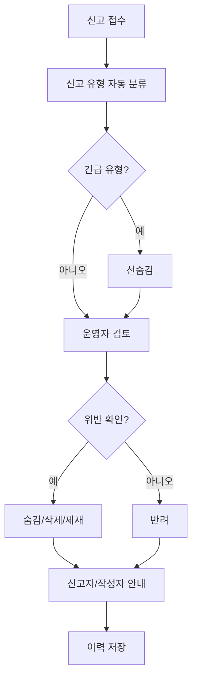

# 08. 커뮤니티 모더레이션 가이드 최종본

---

## 문서 통제 정보

| 항목        | 내용                                                                                   |
| ----------- | -------------------------------------------------------------------------------------- |
| 프로젝트    | 급여납치 Salary Hijacking 플랫폼                                                       |
| 문서 상태   | 문서상·이론상 최종본                                                                   |
| 기준일      | 2026-06-15                                                                             |
| 적용 범위   | 모바일 앱, API 서버, Neon DB, Cloudflare, GitHub 기반 운영 환경                        |
| 핵심 도메인 | 급여 관리, 예산 관리, 지출 기록, 레벨업, 커뮤니티, 알림, 광고/제휴, 관리자 운영        |
| 운영 기준   | 사용자의 급여·대출·저축·소비 내역은 서비스 내부에서 고위험 재무성 개인정보로 취급한다. |
| 변경 원칙   | 본 문서의 기준 변경은 운영 책임자, 제품 책임자, 기술 책임자 승인 후 버전 관리한다.     |

---

## 1. 목적

본 문서는 급여납치 커뮤니티의 게시글, 댓글, 신고, 익명글, 제재, 복구, 이의제기 운영 기준을 정의한다. 커뮤니티는 직장인/아르바이트생의 급여관리, 소비관리, 자기계발, 일상 소통을 위한 공간이며, 금융 오정보·개인정보 노출·혐오·스팸을 엄격히 관리한다.

## 2. 커뮤니티 게시판 구조

| 게시판      | 목적             | 허용 주제                         | 주의 사항                |
| ----------- | ---------------- | --------------------------------- | ------------------------ |
| 전체 게시판 | 전체 글 모아보기 | 모든 허용 게시글                  | 카테고리 표시 필수       |
| 자유 게시판 | 직장인/일상 소통 | 월급, 소비, 직장생활, 고민        | 타인 비방 금지           |
| 레벨업 인증 | 자기계발 인증    | 독서, 운동, 영어, 뉴스, 절약 인증 | 허위 인증/도배 금지      |
| 취미 게시판 | 취미와 루틴 공유 | 독서, 운동, 취미, 부업 경험       | 불법 부업/투자 유도 금지 |

## 3. 기본 운영 원칙

1. 익명성을 보장하되, 정책 위반 시 내부 식별과 제재는 가능해야 한다.
2. 급여·회사·개인 정보를 과도하게 노출하는 글은 보호 관점에서 숨김 처리할 수 있다.
3. 금융성 조언은 개인 경험 공유 수준만 허용하며, 수익 보장·투자 권유는 금지한다.
4. 신고만으로 자동 삭제하지 않고, 기준에 따라 검토한다.
5. 명백한 불법·개인정보·위험 콘텐츠는 선숨김 후검토한다.

## 4. 위반 유형별 처리 기준

| 위반 유형     | 예시                                | 1차 조치           | 반복/중대 조치  |
| ------------- | ----------------------------------- | ------------------ | --------------- |
| 욕설/비방     | 인신공격, 조롱, 모욕                | 댓글/글 숨김, 경고 | 작성 제한, 정지 |
| 혐오/차별     | 성별, 지역, 직업, 장애 비하         | 삭제, 경고         | 정지            |
| 개인정보 노출 | 실명, 전화번호, 계좌, 회사 내부자료 | 즉시 숨김/삭제     | 정지 가능       |
| 금융 오정보   | 확정 수익, 리딩방, 불법 투자        | 삭제, 경고         | 영구 정지 가능  |
| 스팸/광고     | 반복 홍보, 외부 링크 도배           | 삭제               | 작성 제한/정지  |
| 음란/불법     | 불법 촬영, 성적 콘텐츠              | 즉시 삭제          | 영구 정지       |
| 폭력/위험     | 자해 조장, 폭력 선동                | 숨김/삭제          | 보호 조치/정지  |
| 저작권 침해   | 책/기사 전문 무단 복사              | 삭제 요청          | 반복 시 제한    |
| 허위 인증     | 미션/보상 조작                      | 보상 회수          | 정지            |

## 5. 신고 처리 SLA

| 등급 | 기준                            |    최초 검토 |    최종 조치 |
| ---- | ------------------------------- | -----------: | -----------: |
| 긴급 | 개인정보, 불법, 자해/위험, 음란 |    30분 이내 |   4시간 이내 |
| 높음 | 혐오, 금융 사기, 반복 스팸      |   4시간 이내 | 1영업일 이내 |
| 일반 | 욕설, 분쟁, 카테고리 오류       | 1영업일 이내 | 3영업일 이내 |
| 낮음 | 품질 낮음, 중복 글              | 3영업일 이내 | 5영업일 이내 |

## 6. 신고 처리 프로세스

## 7. 제재 단계

| 단계 | 명칭      | 조치                         | 적용 기준                 |
| ---: | --------- | ---------------------------- | ------------------------- |
|    0 | 안내      | 정책 안내                    | 경미한 실수               |
|    1 | 경고      | 경고 메시지 발송             | 1차 위반                  |
|    2 | 작성 제한 | 24시간~7일 글/댓글 제한      | 반복 위반                 |
|    3 | 이용 정지 | 7일~30일 커뮤니티 이용 제한  | 중대 또는 반복 위반       |
|    4 | 영구 정지 | 커뮤니티 또는 계정 영구 제한 | 불법, 사기, 개인정보 악용 |

## 8. 익명글 처리 기준

| 상황            | 처리                                  |
| --------------- | ------------------------------------- |
| 정상 익명글     | 닉네임 비노출 유지                    |
| 신고된 익명글   | 운영자는 내부 ID로 작성자 확인 가능   |
| 개인정보 침해   | 즉시 숨김/삭제 가능                   |
| 법적 요청       | 적법한 절차에 따라 내부 기준으로 처리 |
| 작성자 이의제기 | 티켓으로 접수 후 재검토               |

## 9. 삭제/숨김/복구 기준

| 조치     | 사용자 표시                             | 복구 가능 여부 | 기준                       |
| -------- | --------------------------------------- | -------------- | -------------------------- |
| 숨김     | “운영 정책에 따라 숨김 처리되었습니다.” | 가능           | 검토 필요 또는 경미 위반   |
| 삭제     | “삭제된 게시글입니다.”                  | 제한적 가능    | 명백한 정책 위반           |
| 블라인드 | “신고 누적으로 검토 중입니다.”          | 가능           | 신고 집중 발생             |
| 복구     | 정상 노출                               | 해당 없음      | 오조치 또는 위반 없음 확인 |

## 10. 모더레이터 응대 문구

### 10.1 신고 접수 안내

신고가 접수되었습니다. 운영 정책에 따라 내용을 검토한 뒤 필요한 조치를 진행하겠습니다.

### 10.2 게시글 숨김 안내

작성하신 게시글은 운영 정책 검토가 필요하여 임시 숨김 처리되었습니다. 검토 결과에 따라 복구 또는 삭제될 수 있습니다.

### 10.3 삭제 안내

작성하신 게시글은 커뮤니티 운영 정책 위반으로 삭제되었습니다. 반복 위반 시 글쓰기 제한 또는 이용 제한이 적용될 수 있습니다.

### 10.4 이의제기 안내

조치에 이의가 있는 경우 고객센터를 통해 이의제기를 접수해 주세요. 운영팀이 처리 이력과 정책 기준을 다시 확인하겠습니다.

## 11. 금지 운영 행위

- 운영자가 개인 감정으로 게시글을 삭제하는 행위
- 신고 수만 보고 검토 없이 영구 제재하는 행위
- 익명 작성자의 신원을 외부에 공개하는 행위
- 특정 정치/투자/광고 의견을 운영자 임의로 우대하는 행위
- 사용자 급여/대출/저축 정보를 커뮤니티 조치 사유로 공개하는 행위

## 12. 모더레이션 지표

| 지표                 | 산식                           |          목표 |
| -------------------- | ------------------------------ | ------------: |
| 신고 처리 SLA 준수율 | SLA 내 처리 / 전체 신고        |      95% 이상 |
| 오조치율             | 복구된 조치 / 전체 조치        |       3% 이하 |
| 반복 위반자 비율     | 반복 제재 사용자 / 제재 사용자 |     감소 추세 |
| 신고 반려율          | 반려 신고 / 전체 신고          | 품질 모니터링 |
| 커뮤니티 활성도      | 게시글+댓글+좋아요             |     증가 추세 |

## 13. 완료 선언

본 문서는 급여납치 커뮤니티 모더레이션의 문서상·이론상 최종 기준이다. 본 문서의 신고, 숨김, 삭제, 제재, 익명글, 복구, 지표 기준을 충족하면 커뮤니티 운영은 최종 완료 상태로 판정한다.
