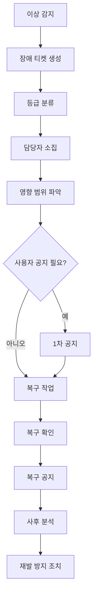

# 09. 장애 대응 매뉴얼 최종본

---

## 문서 통제 정보

| 항목        | 내용                                                                                   |
| ----------- | -------------------------------------------------------------------------------------- |
| 프로젝트    | 급여납치 Salary Hijacking 플랫폼                                                       |
| 문서 상태   | 문서상·이론상 최종본                                                                   |
| 기준일      | 2026-06-15                                                                             |
| 적용 범위   | 모바일 앱, API 서버, Neon DB, Cloudflare, GitHub 기반 운영 환경                        |
| 핵심 도메인 | 급여 관리, 예산 관리, 지출 기록, 레벨업, 커뮤니티, 알림, 광고/제휴, 관리자 운영        |
| 운영 기준   | 사용자의 급여·대출·저축·소비 내역은 서비스 내부에서 고위험 재무성 개인정보로 취급한다. |
| 변경 원칙   | 본 문서의 기준 변경은 운영 책임자, 제품 책임자, 기술 책임자 승인 후 버전 관리한다.     |

---

## 1. 목적

본 문서는 급여납치 플랫폼에서 장애, 성능 저하, 데이터 오류, 알림 실패, 보안 사고 의심 상황이 발생했을 때 감지, 등급 분류, 대응, 복구, 공지, 사후 분석을 수행하기 위한 최종 운영 매뉴얼이다.

## 2. 장애 대응 원칙

1. 사용자 영향이 큰 장애는 원인 분석보다 사용자 보호와 복구를 우선한다.
2. 급여·지출·저축 데이터 불일치는 일반 UI 오류보다 높은 등급으로 처리한다.
3. 장애 상황은 추정이 아닌 확인된 사실 기준으로 공지한다.
4. 모든 장애는 타임라인, 담당자, 영향 범위, 조치 내역을 기록한다.
5. 복구 후 재발 방지 항목을 반드시 산출한다.

## 3. 장애 등급

| 등급  | 명칭      | 기준                                                 | 예시                               |    최초 대응 |
| ----- | --------- | ---------------------------------------------------- | ---------------------------------- | -----------: |
| SEV-0 | 중대 장애 | 전체 서비스 불가, 개인정보 유출 의심, 금액 대량 오류 | 로그인 전체 불가, 타인 데이터 노출 |    15분 이내 |
| SEV-1 | 심각 장애 | 핵심 기능 다수 사용자 불가                           | 급여 홈 로딩 실패, 지출 저장 실패  |    30분 이내 |
| SEV-2 | 주요 장애 | 일부 기능 장애 또는 성능 저하                        | 커뮤니티 목록 지연, 푸시 발송 실패 |   1시간 이내 |
| SEV-3 | 일반 장애 | 우회 가능한 오류                                     | 특정 화면 UI 깨짐                  | 1영업일 이내 |
| SEV-4 | 경미 이슈 | 운영 영향 낮음                                       | 오탈자, 일부 로그 누락             |    계획 반영 |

## 4. 장애 담당 역할

| 역할                   | 책임                                     |
| ---------------------- | ---------------------------------------- |
| Incident Commander     | 전체 상황 판단, 우선순위, 의사결정       |
| Tech Lead              | 원인 분석, 복구 작업 지휘                |
| Backend Owner          | API, DB, 배치, 푸시 장애 대응            |
| Frontend Owner         | 앱 화면, 클라이언트 오류 대응            |
| Infra Owner            | Cloudflare, Neon DB, 배포, 네트워크 대응 |
| CS Lead                | 사용자 문의 분류, 답변 템플릿 배포       |
| Comms Owner            | 공지, 푸시, 상태 업데이트 작성           |
| Security/Privacy Owner | 보안/개인정보 사고 판단                  |

## 5. 장애 대응 프로세스



## 6. 장애 유형별 대응

### 6.1 로그인 장애

| 단계 | 조치                              |
| ---- | --------------------------------- |
| 1    | 로그인 API 오류율 확인            |
| 2    | 소셜 로그인 제공자 장애 여부 확인 |
| 3    | 토큰 발급/검증 로직 확인          |
| 4    | 배포 직후 장애면 롤백 검토        |
| 5    | 사용자에게 로그인 지연 공지       |

### 6.2 급여/금액 계산 오류

| 단계 | 조치                                |
| ---- | ----------------------------------- |
| 1    | 오류 발생 사용자 범위 확인          |
| 2    | 계산 정책 변경/배포 이력 확인       |
| 3    | 원본 입력값과 계산 결과 비교        |
| 4    | 잘못 계산된 집계값 재산출           |
| 5    | 사용자에게 정정 안내 필요 여부 판단 |

### 6.3 지출 저장 실패

| 단계 | 조치                                    |
| ---- | --------------------------------------- |
| 1    | expense_create API 오류율 확인          |
| 2    | DB 쓰기 커넥션/락 확인                  |
| 3    | 중복 요청/멱등성 키 확인                |
| 4    | 임시 저장/재시도 안내                   |
| 5    | 복구 후 누락 데이터 보정 가능 여부 확인 |

### 6.4 푸시 알림 장애

| 단계 | 조치                         |
| ---- | ---------------------------- |
| 1    | 발송 큐 상태 확인            |
| 2    | FCM/APNs 응답 오류 확인      |
| 3    | 중복 발송 여부 확인          |
| 4    | 미발송 대상 재발송 여부 판단 |
| 5    | 중복 발송 시 사과 공지 검토  |

### 6.5 커뮤니티 장애

| 단계 | 조치                               |
| ---- | ---------------------------------- |
| 1    | 게시글 목록/상세 API 응답 확인     |
| 2    | 검색/필터 쿼리 성능 확인           |
| 3    | 스팸/트래픽 급증 여부 확인         |
| 4    | 캐시 적용 또는 일시 제한           |
| 5    | 복구 후 신고/게시글 누락 여부 확인 |

## 7. 긴급 공지 기준

| 상황               | 공지 여부       | 최초 공지 목표 |
| ------------------ | --------------- | -------------: |
| 전체 로그인 불가   | 필수            |      30분 이내 |
| 급여/금액 오류     | 필수            |      30분 이내 |
| 개인정보 노출 의심 | 필수, 별도 절차 |           즉시 |
| 일부 화면 지연     | 상황별          |     1시간 이내 |
| 단순 오탈자        | 불필요          |      해당 없음 |

## 8. 장애 공지 템플릿

### 8.1 발생 공지

```markdown
# [장애 안내] 일부 기능 이용 장애 안내

현재 급여납치 일부 기능에서 이용 장애가 발생하고 있습니다.

- 발생 시각: YYYY-MM-DD HH:MM
- 영향 범위: 예) 급여 홈, 지출 기록, 커뮤니티 목록
- 현재 상태: 원인 확인 및 복구 진행 중
- 사용자 조치: 복구 전까지 동일 작업 반복 입력을 자제해 주세요.

복구 상황은 본 공지를 통해 업데이트하겠습니다.
```

### 8.2 복구 공지

```markdown
# [복구 완료] 서비스 이용 장애 복구 안내

발생했던 장애가 복구되었습니다.

- 복구 시각: YYYY-MM-DD HH:MM
- 영향 범위: 예) 급여 홈, 지출 기록
- 조치 내용: 관련 서버 안정화 및 데이터 정합성 확인

이용에 불편을 드려 죄송합니다.
```

## 9. 장애 기록 양식

| 항목        | 내용             |
| ----------- | ---------------- |
| incidentId  | INC-YYYYMMDD-001 |
| 등급        | SEV-0~SEV-4      |
| 발생 시각   |                  |
| 감지 시각   |                  |
| 복구 시각   |                  |
| 영향 기능   |                  |
| 영향 사용자 |                  |
| 원인        |                  |
| 조치        |                  |
| 사용자 공지 |                  |
| 재발 방지   |                  |
| 담당자      |                  |

## 10. 사후 분석 RCA 기준

| 항목          | 질문                                 |
| ------------- | ------------------------------------ |
| What happened | 무엇이 발생했는가                    |
| Impact        | 어떤 사용자와 기능이 영향을 받았는가 |
| Detection     | 어떻게 감지되었는가                  |
| Root cause    | 근본 원인은 무엇인가                 |
| Resolution    | 어떻게 복구했는가                    |
| Prevention    | 재발 방지 조치는 무엇인가            |
| Follow-up     | 남은 작업과 담당자는 누구인가        |

## 11. 장애 지표

| 지표                      |                  목표 |
| ------------------------- | --------------------: |
| MTTD, 평균 감지 시간      |              5분 이하 |
| MTTA, 평균 대응 시작 시간 |             15분 이하 |
| MTTR, 평균 복구 시간      | SEV-1 기준 2시간 이하 |
| 장애 재발률               |            월 5% 이하 |
| 공지 지연 건수            |                   0건 |
| 데이터 정합성 사고        |              0건 목표 |

## 12. 완료 선언

본 문서는 급여납치 장애 대응의 문서상·이론상 최종 기준이다. 본 문서의 장애 등급, 역할, 프로세스, 공지, RCA, 지표 기준을 충족하면 장애 대응 체계는 최종 완료 상태로 판정한다.
