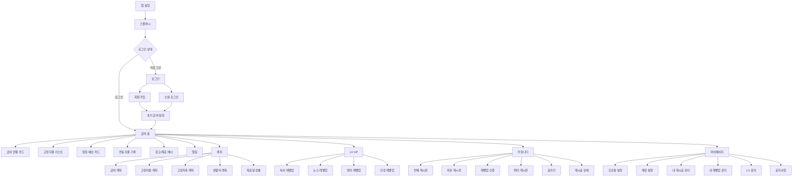

> 본 문서는 급여납치 플랫폼의 UX/UI 설계, 화면 구현, 인터랙션 구현, 디자인 시스템 적용, QA 검수의 최종 기준이다. 본 문서에 정의된 내용은 별도 변경 승인 전까지 최종 기준으로 적용한다.

# IA 정보구조도 최종본

## 1. 문서 목적

본 문서는 급여납치 모바일 애플리케이션의 정보구조를 최종 확정한다. 하단 탭, 상위 메뉴, 하위 화면, 보조 화면, 진입 경로, 기능 소속을 명확히 정의하여 화면 설계, 라우팅, 개발, QA의 단일 기준으로 사용한다.

## 2. IA 설계 결론

급여납치의 정보구조는 **급여 홈을 중심으로 계획, LV UP, 커뮤니티, 마이페이지가 하단 탭으로 연결되고, 알림과 글쓰기 등 보조 기능이 상단/플로팅 액션으로 연결되는 5탭 구조**로 확정한다.

## 3. 최상위 메뉴 구조

| 레벨 | 메뉴            | 역할                                      | 노출 방식            | 우선순위 |
| ---- | --------------- | ----------------------------------------- | -------------------- | -------- |
| L0   | 스플래시        | 앱 진입 및 브랜드 인지                    | 앱 실행 시 자동      | P1       |
| L0   | 로그인/회원가입 | 인증 및 사용자 식별                       | 비로그인 상태 기본   | P1       |
| L1   | 급여 홈         | 급여 현황, 납치금액, 일일 예산, 지출 기록 | 하단 탭 1번          | P1       |
| L1   | 계획            | 급여, 고정지출, 고정저축, 생활비 계획     | 하단 탭 2번          | P1       |
| L1   | LV UP           | 독서, 뉴스, 영어, 건강 자기계발 미션      | 하단 탭 3번          | P2       |
| L1   | 커뮤니티        | 게시판, 인기글, 인증글, 글쓰기            | 하단 탭 4번          | P2       |
| L1   | 마이페이지      | 프로필, 성과, 내 활동, 고객지원           | 하단 탭 5번          | P2       |
| L2   | 알림            | 목표, 결제, 미션, 이벤트 알림             | 상단 알림 아이콘     | P2       |
| L2   | 글쓰기          | 게시글 작성                               | 커뮤니티 플로팅 버튼 | P2       |

## 4. IA 트리

## 5. 탭별 정보구조 상세

### 5.1 급여 홈

| 하위 정보          | 설명                                | 데이터 출처       | 주요 행동      |
| ------------------ | ----------------------------------- | ----------------- | -------------- |
| 기준일/급여일      | 오늘 날짜, 이번 급여일, 다음 급여일 | PayrollPlan       | 확인           |
| 전체 누적 납치금액 | 사용자가 지금까지 지켜낸 총 금액    | PayrollSummary    | 확인           |
| 수령금액           | 이번 달 급여 수령 또는 예정 금액    | PayrollPlan       | 계획 수정 진입 |
| 지출금액           | 고정지출 + 변동지출 + 생활비 사용액 | ExpenseSummary    | 확인           |
| 납치금액           | 수령금액 - 지출금액 - 확정 제외액   | CalculationEngine | 확인           |
| 고정지출           | 구독, 대출, 자동결제, 보험 등       | FixedExpense      | 완료/수정      |
| 일일 예산          | 설정금액, 사용금액, 남은금액        | DailyBudget       | 지출 추가      |
| 변동지출           | 오늘 입력한 소비 내역               | VariableExpense   | 추가/수정/삭제 |
| 광고 배너          | 운영 또는 제휴 배너                 | AdPlacement       | 클릭           |

### 5.2 계획

| 하위 정보     | 설명                                   | 주요 행동      |
| ------------- | -------------------------------------- | -------------- |
| 목표 달성률   | 목표 납치금액 대비 누적금액 비율       | 확인           |
| 급여 계획     | 급여일, 수령 예정 급여, 지출 예정 금액 | 추가/수정      |
| 고정지출 계획 | 반복 지출 항목과 결제일                | 추가/수정/삭제 |
| 고정저축 계획 | 저축, 청약, 투자 등 고정 납입          | 추가/수정/삭제 |
| 생활비 계획   | 일일 예산과 월 생활비                  | 추가/수정      |

### 5.3 LV UP

| 하위 정보 | 설명                       | 주요 행동 |
| --------- | -------------------------- | --------- |
| 현재 레벨 | 사용자 성장 레벨           | 확인      |
| 경험치    | 미션 수행 누적 경험치      | 확인      |
| 독서      | 추천 도서와 독서 미션      | 도전/완료 |
| 뉴스      | 경제/산업/사회/기술 뉴스   | 읽기/완료 |
| 영어      | 듣기/말하기/읽기/쓰기 미션 | 학습/완료 |
| 건강      | 요일별 홈트와 건강 미션    | 운동/완료 |

### 5.4 커뮤니티

| 하위 정보   | 설명                           | 주요 행동 |
| ----------- | ------------------------------ | --------- |
| 인기 게시글 | 조회/반응이 높은 글            | 조회      |
| 전체 게시판 | 모든 글 통합                   | 탐색      |
| 자유 게시판 | 자유 주제                      | 작성/조회 |
| 레벨업 인증 | 미션 인증과 성과 공유          | 작성/조회 |
| 취미 게시판 | 직장인 취미 공유               | 작성/조회 |
| 글쓰기      | 게시글 등록                    | 작성/완료 |
| 게시글 상세 | 본문, 댓글, 좋아요, 공유, 신고 | 상호작용  |

### 5.5 마이페이지

| 하위 정보      | 설명                   | 주요 행동      |
| -------------- | ---------------------- | -------------- |
| 프로필         | 닉네임, 직무, 이미지   | 수정           |
| 누적 납치금액  | 사용자 총 성과         | 확인           |
| 레벨업 현황    | 레벨과 경험치          | 확인           |
| 자기관리 성과  | 미션 수행 성과         | 확인           |
| 내 게시글 관리 | 작성글 목록            | 조회/수정/삭제 |
| 내 레벨업 관리 | 수행 기록              | 조회           |
| 1:1 문의       | 문의 등록 및 답변 확인 | 작성/조회      |
| 공지사항       | 운영 공지              | 조회           |

## 6. 라우팅 기준

| 라우트              | 화면           | 접근 조건                    | 로그인 필요 |
| ------------------- | -------------- | ---------------------------- | ----------- |
| /splash             | 스플래시       | 앱 실행                      | 아니오      |
| /login              | 로그인         | 비로그인                     | 아니오      |
| /signup             | 회원가입       | 로그인 화면에서 진입         | 아니오      |
| /onboarding/payroll | 초기 급여 설정 | 신규 가입 또는 미설정 사용자 | 예          |
| /home               | 급여 홈        | 로그인 완료                  | 예          |
| /plan               | 계획           | 하단 탭                      | 예          |
| /level              | LV UP          | 하단 탭                      | 예          |
| /level/book         | 독서 레벨업    | LV UP 진입                   | 예          |
| /level/news         | 뉴스 레벨업    | LV UP 진입                   | 예          |
| /level/english      | 영어 레벨업    | LV UP 진입                   | 예          |
| /level/health       | 건강 레벨업    | LV UP 진입                   | 예          |
| /community          | 커뮤니티       | 하단 탭                      | 예          |
| /community/post/:id | 게시글 상세    | 게시글 선택                  | 예          |
| /community/write    | 글쓰기         | 플로팅 버튼                  | 예          |
| /profile            | 마이페이지     | 하단 탭                      | 예          |
| /alerts             | 알림           | 상단 알림 아이콘             | 예          |

## 7. 권한별 IA 노출 기준

| 사용자 상태           | 노출 화면                        | 제한 화면                                       |
| --------------------- | -------------------------------- | ----------------------------------------------- |
| 비회원                | 스플래시, 로그인, 회원가입, 약관 | 급여 홈, 계획, LV UP, 커뮤니티 작성, 마이페이지 |
| 신규 회원/급여 미설정 | 초기 급여 설정, 약관, 알림 권한  | 급여 홈 일부 수치, 고급 계획                    |
| 일반 회원             | 전체 사용자 화면                 | 관리자 화면                                     |
| 운영자                | 운영자 관리 화면, 일반 화면      | 최고관리자 권한                                 |
| 정지 회원             | 로그인, 정지 안내, 문의          | 커뮤니티 작성, 댓글, 좋아요                     |
| 탈퇴 회원             | 로그인, 재가입 안내              | 기존 데이터 접근                                |

## 8. IA 불변 규칙

1. 하단 탭은 급여, 계획, LV, 커뮤니티, MY 순서를 유지한다.
2. 급여 홈은 앱의 기본 랜딩 화면으로 유지한다.
3. 알림은 상단 우측 아이콘에서 접근한다.
4. 글쓰기는 커뮤니티 화면에서만 플로팅 버튼으로 노출한다.
5. 급여·지출·저축 관련 데이터는 커뮤니티에 자동 노출하지 않는다.
6. 광고 배너는 핵심 금액 정보보다 위에 배치하지 않는다.
7. 미션 완료는 LV UP과 마이페이지 성과에 동시에 반영한다.
8. 모든 금액 변경은 홈, 계획, 마이페이지 집계에 일관 반영한다.

## 공통 UX 원칙

| 원칙             | 최종 기준                                                                                              |
| ---------------- | ------------------------------------------------------------------------------------------------------ |
| 급여 중심성      | 모든 주요 화면은 사용자가 이번 급여에서 얼마를 지켜냈는지 이해하도록 설계한다.                         |
| 하루 행동화      | 월 단위 계획은 일일 예산과 오늘의 행동으로 변환되어야 한다.                                            |
| 즉시 피드백      | 금액 입력, 저장, 삭제, 미션 완료, 글쓰기 완료 후 수치와 상태가 즉시 반영되어야 한다.                   |
| 입력 부담 최소화 | 반복 입력은 템플릿, 지난달 복사, 기본값, 빠른 추가 방식으로 줄인다.                                    |
| 신뢰 우선        | 급여·지출·저축 데이터는 민감정보로 보이므로 과장된 광고성 표현보다 명확한 상태와 정책 안내를 우선한다. |
| 모바일 우선      | 모든 화면은 한 손 조작, 하단 탭, 안전영역, 작은 화면 가독성을 기준으로 설계한다.                       |

## 9. 최종 완료 기준

| 검수 항목      | 완료 기준                        | 상태 |
| -------------- | -------------------------------- | ---- |
| 상위 메뉴 구조 | 5탭 구조 확정                    | 완료 |
| 하위 화면 연결 | 모든 주요 화면 연결 정의         | 완료 |
| 권한별 노출    | 비회원/회원/운영자 기준 정의     | 완료 |
| 라우팅 기준    | 구현 가능한 URL/스크린 경로 정의 | 완료 |
| 데이터 소속    | 각 정보의 기능 소속 정의         | 완료 |
| 변경 통제      | IA 불변 규칙 정의                | 완료 |
