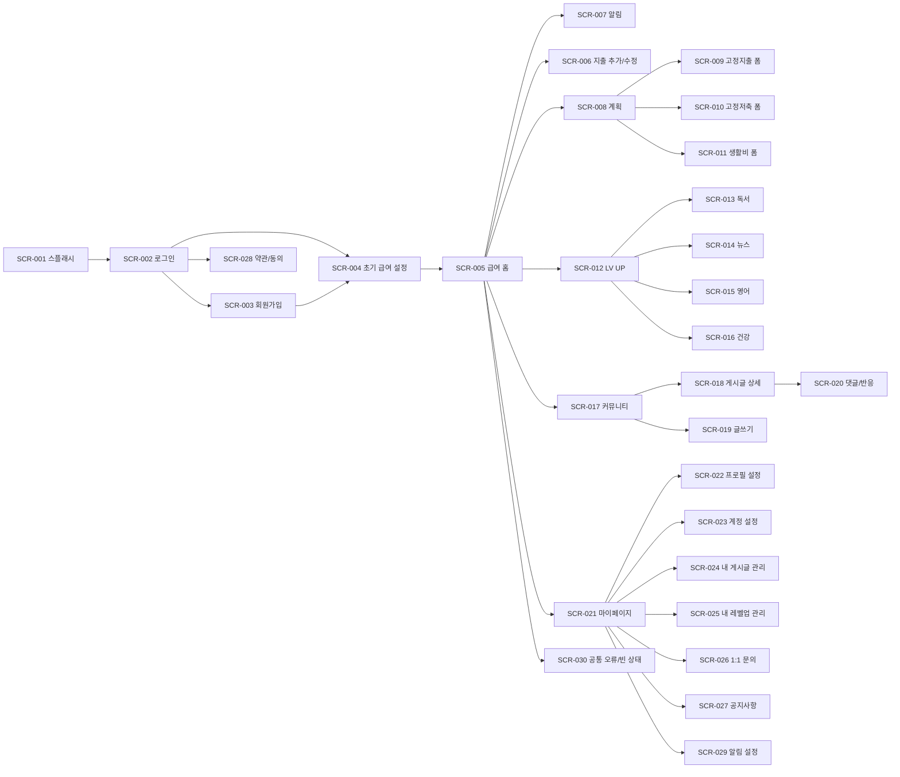

> 본 문서는 급여납치 플랫폼의 UX/UI 설계, 화면 구현, 인터랙션 구현, 디자인 시스템 적용, QA 검수의 최종 기준이다. 본 문서에 정의된 내용은 별도 변경 승인 전까지 최종 기준으로 적용한다.

# 사이트맵 앱맵 최종본

## 1. 문서 목적

본 문서는 급여납치 앱의 전체 화면 목록, 화면 ID, 화면명, 진입 경로, 연결 관계, 화면 유형, 로그인 필요 여부를 최종 확정한다. 개발 라우팅, 화면 파일 생성, QA 테스트 범위, 디자인 산출물 관리의 기준 문서로 사용한다.

## 2. 화면 ID 체계

| 구분        | 규칙           | 예시    |
| ----------- | -------------- | ------- |
| 화면 ID     | SCR-3자리 숫자 | SCR-001 |
| 모달 ID     | MOD-3자리 숫자 | MOD-001 |
| 컴포넌트 ID | CMP-3자리 숫자 | CMP-001 |
| 상태 ID     | STA-3자리 숫자 | STA-001 |
| 기능 ID     | FUN-3자리 숫자 | FUN-001 |

## 3. 전체 앱맵

## 4. 화면 목록 최종본

| 화면 ID | 화면명            | 화면 유형 | 진입 경로              | 주요 연결                               | 로그인 필요 | 우선순위 |
| ------- | ----------------- | --------- | ---------------------- | --------------------------------------- | ----------- | -------- |
| SCR-001 | 스플래시          | 진입      | 앱 실행                | 로그인 또는 홈                          | 아니오      | P1       |
| SCR-002 | 로그인            | 인증      | 스플래시, 로그아웃     | 회원가입, 약관, 홈                      | 아니오      | P1       |
| SCR-003 | 회원가입          | 인증      | 로그인                 | 약관, 초기 급여 설정                    | 아니오      | P1       |
| SCR-004 | 초기 급여 설정    | 온보딩    | 신규 가입, 급여 미설정 | 급여 홈                                 | 예          | P1       |
| SCR-005 | 급여 홈           | 메인      | 로그인 완료, 하단 탭   | 알림, 지출 추가, 계획, LV, 커뮤니티, MY | 예          | P1       |
| SCR-006 | 지출 추가/수정    | 입력      | 급여 홈                | 급여 홈                                 | 예          | P1       |
| SCR-007 | 알림              | 목록      | 상단 알림 아이콘       | 관련 화면                               | 예          | P2       |
| SCR-008 | 계획              | 메인 탭   | 하단 계획 탭           | 고정지출 폼, 저축 폼, 생활비 폼         | 예          | P1       |
| SCR-009 | 고정지출 폼       | 입력      | 계획                   | 계획                                    | 예          | P1       |
| SCR-010 | 고정저축 폼       | 입력      | 계획                   | 계획                                    | 예          | P1       |
| SCR-011 | 생활비 폼         | 입력      | 계획                   | 계획, 급여 홈                           | 예          | P1       |
| SCR-012 | LV UP             | 메인 탭   | 하단 LV 탭             | 독서, 뉴스, 영어, 건강                  | 예          | P2       |
| SCR-013 | 독서 레벨업       | 콘텐츠    | LV UP                  | LV UP, 미션 완료                        | 예          | P2       |
| SCR-014 | 뉴스 레벨업       | 콘텐츠    | LV UP                  | LV UP, 미션 완료                        | 예          | P2       |
| SCR-015 | 영어 레벨업       | 콘텐츠    | LV UP                  | LV UP, 미션 완료                        | 예          | P2       |
| SCR-016 | 건강 레벨업       | 콘텐츠    | LV UP                  | LV UP, 미션 완료                        | 예          | P2       |
| SCR-017 | 커뮤니티          | 메인 탭   | 하단 커뮤니티 탭       | 게시글 상세, 글쓰기                     | 예          | P2       |
| SCR-018 | 게시글 상세       | 상세      | 게시글 선택            | 댓글, 신고, 공유                        | 예          | P2       |
| SCR-019 | 글쓰기            | 작성      | 커뮤니티 플로팅 버튼   | 커뮤니티, 게시글 상세                   | 예          | P2       |
| SCR-020 | 댓글/반응         | 하위      | 게시글 상세            | 게시글 상세                             | 예          | P2       |
| SCR-021 | 마이페이지        | 메인 탭   | 하단 MY 탭             | 프로필, 계정, 문의, 공지                | 예          | P2       |
| SCR-022 | 프로필 설정       | 설정      | 마이페이지             | 마이페이지                              | 예          | P2       |
| SCR-023 | 계정 설정         | 설정      | 마이페이지             | 로그인, 약관, 알림 설정                 | 예          | P2       |
| SCR-024 | 내 게시글 관리    | 관리      | 마이페이지             | 게시글 상세                             | 예          | P2       |
| SCR-025 | 내 레벨업 관리    | 관리      | 마이페이지             | LV UP 상세                              | 예          | P2       |
| SCR-026 | 1:1 문의          | 고객지원  | 마이페이지             | 문의 작성, 답변 상세                    | 예          | P3       |
| SCR-027 | 공지사항          | 고객지원  | 마이페이지             | 공지 상세                               | 예          | P3       |
| SCR-028 | 약관/동의         | 정책      | 회원가입, 계정 설정    | 회원가입, 계정 설정                     | 아니오/예   | P1       |
| SCR-029 | 알림 설정         | 설정      | 계정 설정, 알림        | 계정 설정                               | 예          | P2       |
| SCR-030 | 공통 오류/빈 상태 | 상태      | 전체 화면              | 이전 화면                               | 조건부      | P1       |

## 5. 모달/바텀시트 목록

| 모달 ID | 명칭             | 호출 위치      | 목적                | 닫힘 조건      | 우선순위 |
| ------- | ---------------- | -------------- | ------------------- | -------------- | -------- |
| MOD-001 | 금액 입력 오류   | 금액 입력 화면 | 숫자/범위 오류 안내 | 확인           | P1       |
| MOD-002 | 지출 삭제 확인   | 지출 상세/수정 | 삭제 전 확인        | 취소/삭제      | P1       |
| MOD-003 | 계획 저장 완료   | 계획           | 저장 완료 안내      | 자동 닫힘/확인 | P1       |
| MOD-004 | 예산 초과 경고   | 지출 추가      | 일일 예산 초과 안내 | 확인           | P1       |
| MOD-005 | 미션 완료        | LV UP          | 경험치 지급 안내    | 확인           | P2       |
| MOD-006 | 레벨업 달성      | LV UP          | 레벨 상승 안내      | 확인           | P2       |
| MOD-007 | 게시글 등록 완료 | 글쓰기         | 게시글 등록 결과    | 확인/상세 보기 | P2       |
| MOD-008 | 신고 접수 완료   | 게시글 상세    | 신고 완료 안내      | 확인           | P2       |
| MOD-009 | 로그아웃 확인    | 계정 설정      | 로그아웃 전 확인    | 취소/로그아웃  | P2       |
| MOD-010 | 회원 탈퇴 확인   | 계정 설정      | 탈퇴 전 최종 확인   | 취소/탈퇴      | P2       |

## 6. 공통 상태 화면

| 상태 ID | 상태명         | 표시 조건          | 기본 문구                    | 주요 CTA   |
| ------- | -------------- | ------------------ | ---------------------------- | ---------- |
| STA-001 | 로딩           | API 요청 중        | 불러오는 중입니다.           | 없음       |
| STA-002 | 네트워크 오류  | 네트워크 실패      | 연결이 불안정합니다.         | 다시 시도  |
| STA-003 | 서버 오류      | 5xx 오류           | 잠시 후 다시 시도해주세요.   | 다시 시도  |
| STA-004 | 권한 없음      | 비로그인/권한 부족 | 로그인이 필요합니다.         | 로그인하기 |
| STA-005 | 빈 지출        | 지출 내역 없음     | 오늘 기록한 지출이 없습니다. | 지출 추가  |
| STA-006 | 빈 게시판      | 게시글 없음        | 아직 게시글이 없습니다.      | 글쓰기     |
| STA-007 | 빈 알림        | 알림 없음          | 새로운 알림이 없습니다.      | 홈으로     |
| STA-008 | 입력 검증 실패 | 필수값 누락        | 필수 항목을 확인해주세요.    | 확인       |

## 7. 화면 연결 규칙

1. 스플래시는 사용자가 임의로 체류하지 않고 자동 이동한다.
2. 로그인 성공 후 급여 정보가 없으면 초기 급여 설정으로 이동한다.
3. 로그인 성공 후 급여 정보가 있으면 급여 홈으로 이동한다.
4. 하단 탭 화면 간 이동 시 각 탭의 마지막 스크롤 위치는 세션 내 유지한다.
5. 알림 상세 연결 대상이 없거나 삭제된 경우 공통 오류/빈 상태를 표시한다.
6. 글쓰기 등록 후 커뮤니티 목록 최상단에 신규 글을 반영한다.
7. 금액 변경 후 홈, 계획, 마이페이지 성과 수치가 동일하게 갱신되어야 한다.
8. 로그아웃 후에는 인증 필요 화면 접근 시 로그인으로 이동한다.

## 8. 최종 완료 기준

| 항목           | 완료 기준                  | 상태 |
| -------------- | -------------------------- | ---- |
| 전체 화면 정의 | 30개 사용자 화면 정의      | 완료 |
| 모달 정의      | 주요 모달 10개 정의        | 완료 |
| 상태 화면 정의 | 공통 상태 8개 정의         | 완료 |
| 진입 경로      | 모든 화면의 진입 경로 명시 | 완료 |
| 연결 관계      | 앱맵과 표로 상호 연결 확정 | 완료 |
| QA 기준        | 화면 누락 검수 가능        | 완료 |
