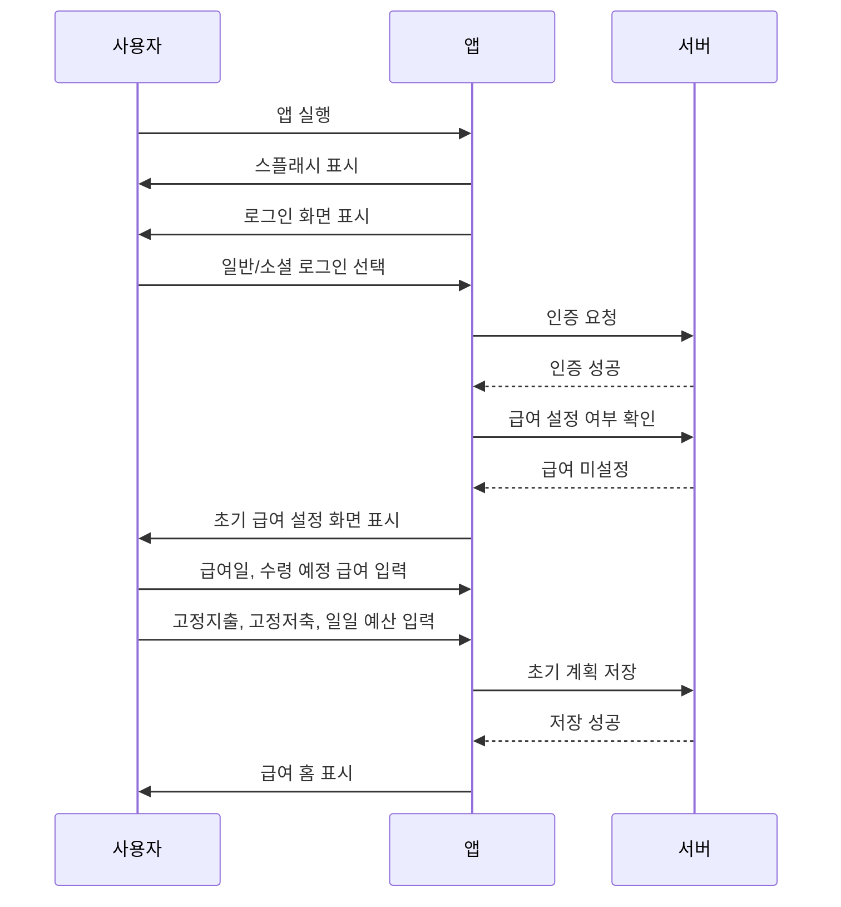
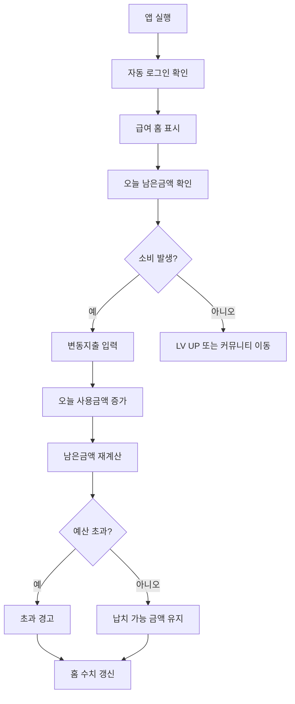
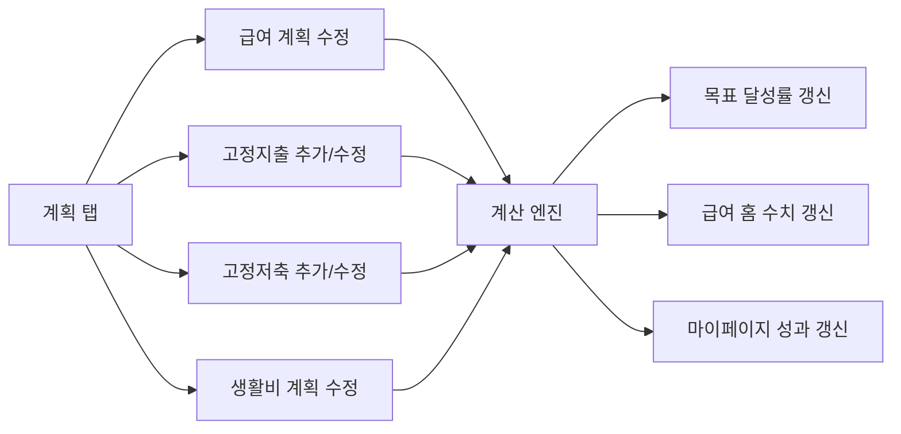
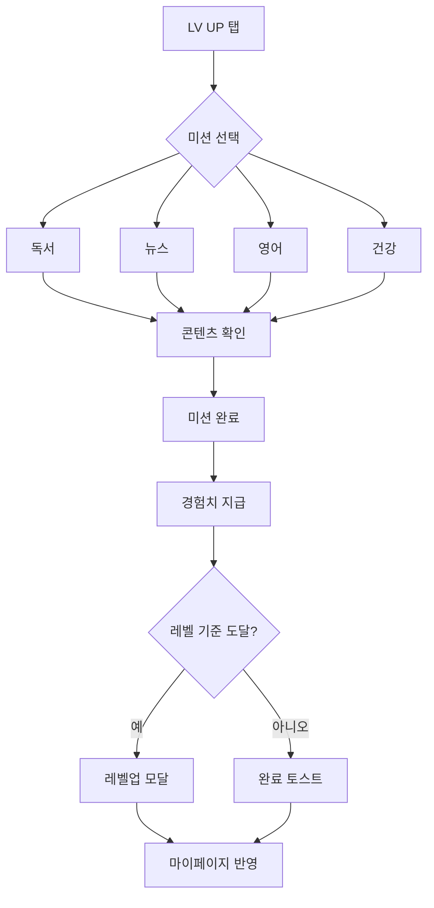

> 본 문서는 급여납치 플랫폼의 UX/UI 설계, 화면 구현, 인터랙션 구현, 디자인 시스템 적용, QA 검수의 최종 기준이다. 본 문서에 정의된 내용은 별도 변경 승인 전까지 최종 기준으로 적용한다.

# 사용자 플로우 문서 최종본

## 1. 문서 목적

본 문서는 급여납치 플랫폼에서 사용자가 수행하는 주요 행동 흐름을 최종 정의한다. 신규 사용자, 기존 사용자, 급여관리, 지출기록, 계획수정, 레벨업, 커뮤니티, 마이페이지, 알림 시나리오의 정상 흐름과 예외 흐름을 포함한다.

## 2. 핵심 플로우 결론

급여납치의 핵심 사용자 플로우는 다음 하나의 루프로 요약된다.

**로그인 → 급여 입력 → 고정지출 등록 → 일일 예산 설정 → 지출 기록 → 납치금액 확인 → 레벨업/커뮤니티 인증 → 다음 날 재방문**

## 3. 신규 사용자 온보딩 플로우

### 3.1 정상 흐름

| 단계 | 사용자 행동         | 시스템 반응         | 성공 기준               |
| ---- | ------------------- | ------------------- | ----------------------- |
| 1    | 앱 실행             | 스플래시 표시       | 2초 이내 다음 화면 이동 |
| 2    | 로그인 선택         | 인증 요청           | 로딩 표시               |
| 3    | 인증 완료           | 급여 설정 여부 조회 | 신규 회원 판정          |
| 4    | 급여일 입력         | 입력값 검증         | 날짜 저장 가능          |
| 5    | 수령 예정 급여 입력 | 금액 포맷 적용      | 원 단위 숫자 저장       |
| 6    | 고정지출 입력       | 항목 합산           | 지출 예정액 반영        |
| 7    | 일일 예산 입력      | 월 생활비 환산      | 홈 수치 반영            |
| 8    | 저장                | 홈 이동             | 납치금액 표시           |

### 3.2 예외 흐름

| 예외               | 조건                        | 처리                                         |
| ------------------ | --------------------------- | -------------------------------------------- |
| 로그인 실패        | 잘못된 계정 또는 OAuth 실패 | 오류 문구와 재시도 버튼 표시                 |
| 급여 미입력        | 필수 금액 누락              | 저장 비활성 또는 필수 안내                   |
| 음수 입력          | 0 미만 금액 입력            | 입력 차단                                    |
| 지출이 급여보다 큼 | 수령금액 < 지출 예정 금액   | 경고 표시, 저장은 허용하되 납치금액 0원 처리 |
| 네트워크 실패      | 저장 API 실패               | 임시 저장 후 재시도 안내                     |

## 4. 기존 사용자 일일 사용 플로우

### 4.1 일일 지출 기록 플로우

| 단계 | 사용자 행동           | 시스템 반응                       | 데이터 반영                 |
| ---- | --------------------- | --------------------------------- | --------------------------- |
| 1    | 홈에서 지출 추가 선택 | 입력 영역/모달 표시               | 없음                        |
| 2    | 항목명 입력           | 텍스트 검증                       | 임시 상태                   |
| 3    | 금액 입력             | 숫자 포맷 적용                    | 임시 상태                   |
| 4    | 추가 버튼 선택        | 지출 저장 API 호출                | VariableExpense 생성        |
| 5    | 저장 성공             | 토스트 표시                       | DailyBudget.usedAmount 증가 |
| 6    | 홈 갱신               | 사용금액/남은금액/납치금액 재계산 | PayrollSummary 갱신         |

### 4.2 일일 예산 초과 플로우

| 조건                      | 처리                                   |
| ------------------------- | -------------------------------------- |
| 사용금액 <= 일일 설정금액 | 남은금액 초록색/기본색 표시            |
| 사용금액 > 일일 설정금액  | 남은금액 빨간색 표시, 초과 경고 토스트 |
| 초과 후 추가 지출         | 초과금액 누적 표시                     |
| 다음 날 진입              | 새 날짜 기준 일일 예산 초기화          |

## 5. 계획 설정 플로우

### 5.1 계획 저장 정상 흐름

1. 사용자는 계획 탭으로 이동한다.
2. 급여, 지출, 저축, 생활비 중 수정 대상을 선택한다.
3. 입력 필드에 값을 입력한다.
4. 저장 버튼을 누른다.
5. 시스템은 필수값, 숫자, 날짜, 반복 조건을 검증한다.
6. 서버에 계획 데이터를 저장한다.
7. 저장 성공 시 목표 달성률, 예상 납치금액, 일일 예산을 재계산한다.
8. 홈 화면과 마이페이지 집계에 반영한다.

### 5.2 계획 저장 예외 흐름

| 예외          | 처리                                       |
| ------------- | ------------------------------------------ |
| 필수값 누락   | 해당 필드 하단에 오류 문구 표시            |
| 금액 0원 입력 | 항목 성격에 따라 경고 또는 저장 차단       |
| 중복 고정지출 | 기존 항목과 결제일/이름이 같으면 중복 확인 |
| 삭제 시도     | 삭제 확인 모달 표시                        |
| 저장 실패     | 변경값 유지, 재시도 제공                   |

## 6. 알림 플로우

| 알림 유형   | 발생 조건           | 클릭 시 이동       | 처리 결과 |
| ----------- | ------------------- | ------------------ | --------- |
| 목표 달성   | 목표 납치금액 도달  | 마이페이지 또는 홈 | 읽음 처리 |
| 결제 예정   | 고정지출일 전/당일  | 계획/고정지출      | 읽음 처리 |
| 예산 초과   | 일일 예산 초과      | 급여 홈            | 읽음 처리 |
| 레벨업 미션 | 정해진 미션 시간    | LV UP              | 읽음 처리 |
| 이벤트 보상 | 보상 지급 조건 충족 | 이벤트/알림 상세   | 읽음 처리 |
| 공지사항    | 운영 공지 등록      | 공지사항 상세      | 읽음 처리 |

## 7. LV UP 플로우

## 8. 커뮤니티 플로우

### 8.1 게시글 조회 흐름

1. 커뮤니티 탭 진입
2. 게시판 탭 선택
3. 게시글 목록 조회
4. 게시글 선택
5. 상세 화면 진입
6. 좋아요, 댓글, 공유, 신고 중 행동 선택
7. 상호작용 결과 즉시 반영

### 8.2 글쓰기 흐름

| 단계 | 사용자 행동               | 시스템 반응             |
| ---- | ------------------------- | ----------------------- |
| 1    | 커뮤니티 플로팅 버튼 선택 | 글쓰기 화면 표시        |
| 2    | 게시판 선택               | 선택 상태 표시          |
| 3    | 제목 입력                 | 글자 수 검증            |
| 4    | 본문 입력                 | 글자 수 검증            |
| 5    | 첨부 선택                 | 파일 형식/용량 검증     |
| 6    | 질문/익명 옵션 선택       | 옵션 상태 저장          |
| 7    | 완료 선택                 | 필수값 검증             |
| 8    | 등록 성공                 | 게시글 목록 최상단 반영 |

## 9. 마이페이지 플로우

| 기능           | 진입                | 핵심 행동                    | 결과           |
| -------------- | ------------------- | ---------------------------- | -------------- |
| 프로필 설정    | MY > 프로필 설정    | 닉네임, 직무, 이미지 수정    | 프로필 갱신    |
| 계정 설정      | MY > 계정 설정      | 로그인 수단, 알림, 탈퇴 관리 | 계정 상태 변경 |
| 내 게시글 관리 | MY > 내 게시글 관리 | 작성글 조회/수정/삭제        | 커뮤니티 반영  |
| 내 레벨업 관리 | MY > 내 레벨업 관리 | 미션 기록 확인               | 성과 확인      |
| 1:1 문의       | MY > 1:1 문의       | 문의 작성                    | 문의 접수      |
| 공지사항       | MY > 공지사항       | 공지 조회                    | 읽음 처리      |

## 10. 플로우 완료 기준

| 기준        | 완료 조건                            | 상태 |
| ----------- | ------------------------------------ | ---- |
| 핵심 루프   | 급여 입력부터 납치금액 확인까지 정의 | 완료 |
| 정상 흐름   | 주요 기능별 정상 흐름 정의           | 완료 |
| 예외 흐름   | 인증, 입력, 저장, 네트워크 예외 정의 | 완료 |
| 데이터 반영 | 각 행동의 데이터 갱신 대상 정의      | 완료 |
| 화면 연결   | 모든 주요 화면 간 이동 정의          | 완료 |
