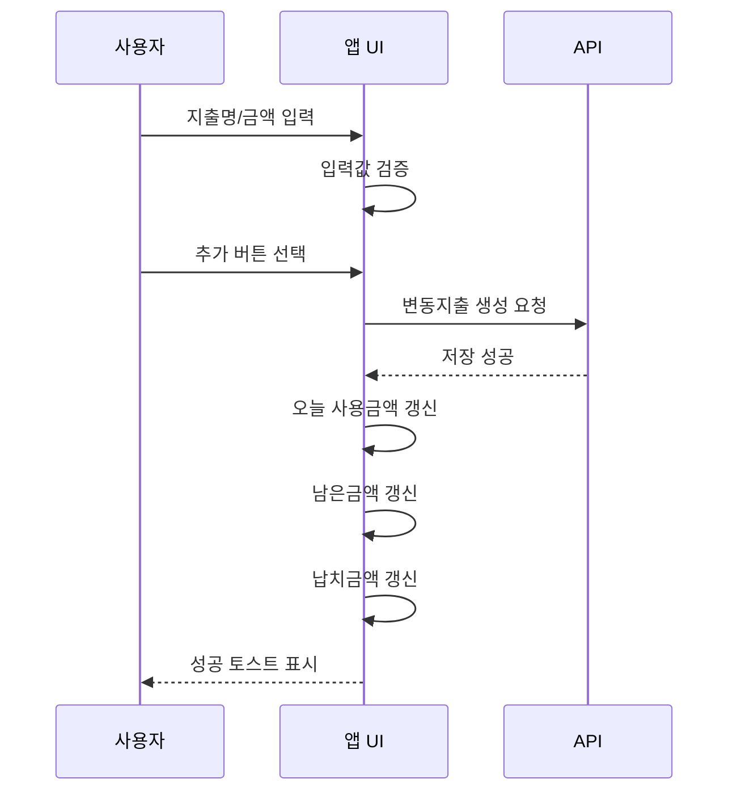

> 본 문서는 급여납치 플랫폼의 UX/UI 설계, 화면 구현, 인터랙션 구현, 디자인 시스템 적용, QA 검수의 최종 기준이다. 본 문서에 정의된 내용은 별도 변경 승인 전까지 최종 기준으로 적용한다.

# 인터랙션 명세서 최종본

## 1. 문서 목적

본 문서는 급여납치 앱의 클릭, 입력, 저장, 추가, 삭제, 탭 전환, 알림 클릭, 글쓰기 완료, 미션 완료 등 사용자 인터랙션과 시스템 반응을 최종 정의한다.

## 2. 인터랙션 기본 원칙

| 원칙        | 기준                                                                        |
| ----------- | --------------------------------------------------------------------------- |
| 즉시성      | 사용자 행동 후 0.1초 이내 시각 피드백 제공                                  |
| 명확성      | 저장/삭제/완료 결과를 토스트 또는 모달로 표시                               |
| 복구성      | 삭제/탈퇴 등 위험 행동은 확인 단계 제공                                     |
| 일관성      | 같은 기능은 모든 화면에서 같은 버튼 색상과 문구 사용                        |
| 차단 최소화 | 검증 오류는 해당 필드에서 즉시 안내하고 전체 흐름을 불필요하게 막지 않는다. |

## 3. 탭 전환 인터랙션

| 항목        | 명세                                 |
| ----------- | ------------------------------------ |
| 대상        | 급여, 계획, LV, 커뮤니티, MY         |
| 동작        | 탭 선택 시 해당 화면으로 즉시 전환   |
| 활성 상태   | 아이콘 컬러 활성화, 라벨 진하게 표시 |
| 비활성 상태 | 회색 아이콘과 라벨 표시              |
| 스크롤      | 각 탭의 스크롤 위치는 세션 동안 유지 |
| 예외        | 글쓰기 중 탭 이동 시 작성 취소 확인  |

## 4. 로그인 인터랙션

| 트리거           | 조건                      | 시스템 반응                 |
| ---------------- | ------------------------- | --------------------------- |
| 일반 로그인 버튼 | 아이디/비밀번호 입력 완료 | 인증 요청, 로딩 표시        |
| 소셜 로그인 버튼 | 버튼 선택                 | OAuth 인증 진행             |
| 자동 로그인 체크 | 체크박스 선택             | 다음 로그인부터 토큰 유지   |
| 회원가입 선택    | 링크 선택                 | 회원가입 화면 이동          |
| 로그인 실패      | 인증 실패                 | 오류 문구 표시, 입력값 유지 |

## 5. 금액 입력 인터랙션

| 동작      | 처리 기준                         |
| --------- | --------------------------------- |
| 숫자 입력 | 숫자만 허용                       |
| 콤마 표시 | 1,000 단위 자동 표시              |
| 원 단위   | 소수점 입력 차단                  |
| 음수 입력 | 입력 차단 또는 0으로 보정         |
| 삭제      | 빈 값 허용, 저장 시 필수 검증     |
| 붙여넣기  | 숫자 이외 문자 제거               |
| 초과 경고 | 지출이 급여보다 클 경우 경고 표시 |

## 6. 지출 추가 인터랙션

| 결과      | 반응                                           |
| --------- | ---------------------------------------------- |
| 저장 성공 | “지출이 추가되었습니다.” 토스트, 입력창 초기화 |
| 금액 누락 | “금액을 숫자로 입력해주세요.”                  |
| 예산 초과 | 남은금액 빨간색, “오늘 예산을 초과했습니다.”   |
| API 실패  | 입력값 유지, 재시도 안내                       |

## 7. 계획 저장 인터랙션

| 트리거         | 조건          | 시스템 반응                     |
| -------------- | ------------- | ------------------------------- |
| 저장 및 재계산 | 필수값 유효   | 저장 API 호출                   |
| 저장 성공      | API 성공      | 달성률/납치금액/생활비 재계산   |
| 저장 실패      | API 실패      | 오류 토스트, 입력값 유지        |
| 값 변경 중     | 사용자가 입력 | 저장 버튼 활성화                |
| 값 변경 없음   | 기존값 동일   | 저장 버튼 비활성 또는 보조 상태 |

## 8. 삭제 인터랙션

| 대상     | 확인 방식      | 삭제 후 처리                 |
| -------- | -------------- | ---------------------------- |
| 변동지출 | 삭제 확인 모달 | 홈 수치 재계산               |
| 고정지출 | 삭제 확인 모달 | 계획/홈 수치 재계산          |
| 고정저축 | 삭제 확인 모달 | 계획/목표 수치 재계산        |
| 게시글   | 삭제 확인 모달 | 커뮤니티 목록에서 제거       |
| 댓글     | 삭제 확인 모달 | 댓글 목록에서 제거           |
| 계정     | 2단계 확인     | 로그아웃 및 데이터 정책 적용 |

## 9. 알림 클릭 인터랙션

| 알림 유형 | 클릭 결과                   | 보조 처리 |
| --------- | --------------------------- | --------- |
| 목표 달성 | 마이페이지 성과 영역 이동   | 읽음 처리 |
| 이벤트    | 이벤트/알림 상세 이동       | 읽음 처리 |
| 독서      | 독서 레벨업 이동            | 읽음 처리 |
| 뉴스      | 뉴스 레벨업 이동            | 읽음 처리 |
| 영어      | 영어 레벨업 이동            | 읽음 처리 |
| 건강      | 건강 레벨업 이동            | 읽음 처리 |
| 결제 예정 | 계획/고정지출 이동          | 읽음 처리 |
| 예산 초과 | 급여 홈 일일 예산 카드 이동 | 읽음 처리 |

## 10. LV UP 완료 인터랙션

| 단계 | 동작                                 |
| ---- | ------------------------------------ |
| 1    | 사용자가 미션 버튼 선택              |
| 2    | 콘텐츠 상세 또는 미션 수행 화면 표시 |
| 3    | 완료 조건 충족                       |
| 4    | 완료 버튼 활성화                     |
| 5    | 완료 선택 시 중복 여부 검증          |
| 6    | 경험치 지급                          |
| 7    | 경험치 100 이상이면 레벨업 모달 표시 |
| 8    | 마이페이지 성과 반영                 |

## 11. 커뮤니티 인터랙션

| 동작           | 반응                               |
| -------------- | ---------------------------------- |
| 게시판 탭 선택 | 해당 카테고리 게시글 목록으로 전환 |
| 게시글 선택    | 게시글 상세로 이동                 |
| 좋아요 선택    | 좋아요 수 +1, 다시 선택 시 취소    |
| 댓글 작성      | 댓글 목록 하단/정렬 기준에 반영    |
| 공유 선택      | OS 공유 시트 또는 링크 복사        |
| 신고 선택      | 신고 사유 선택 후 접수 완료        |
| FAB 선택       | 글쓰기 화면/레이어 표시            |
| 글쓰기 완료    | 필수값 검증 후 등록                |

## 12. 글쓰기 인터랙션

| 동작        | 조건        | 반응             |
| ----------- | ----------- | ---------------- |
| 닫기        | 입력값 없음 | 즉시 닫기        |
| 닫기        | 입력값 있음 | 작성 취소 확인   |
| 게시판 선택 | 선택        | 선택값 저장      |
| 제목 입력   | 2~80자      | 글자 수 정상     |
| 본문 입력   | 5~5000자    | 글자 수 정상     |
| 첨부 선택   | 허용 파일   | 미리보기 표시    |
| 질문 체크   | 선택        | 질문글 뱃지 적용 |
| 익명 체크   | 선택        | 작성자 익명 표시 |
| 완료 선택   | 필수값 충족 | 등록 API 호출    |

## 13. 토스트/모달 표시 기준

| 유형        | 사용 상황             | 지속 시간/닫힘          |
| ----------- | --------------------- | ----------------------- |
| 성공 토스트 | 저장, 추가, 완료      | 1.5~2초 자동 닫힘       |
| 오류 토스트 | 가벼운 입력 오류      | 2초 자동 닫힘           |
| 경고 모달   | 삭제, 탈퇴, 작성 취소 | 사용자 선택 전까지 유지 |
| 완료 모달   | 레벨업, 이벤트 보상   | 확인 버튼               |
| 바텀시트    | 선택형 입력           | 외부 터치 또는 닫기     |

## 14. 최종 완료 기준

| 검수 항목   | 완료 기준                         | 상태 |
| ----------- | --------------------------------- | ---- |
| 탭 전환     | 5개 탭 전환 규칙 정의             | 완료 |
| 저장/추가   | 지출, 계획, 글쓰기 저장 반응 정의 | 완료 |
| 삭제        | 위험 행동 확인 절차 정의          | 완료 |
| 알림        | 유형별 이동 목적지 정의           | 완료 |
| 미션 완료   | 경험치/레벨업 반영 정의           | 완료 |
| 오류 피드백 | 토스트/모달 기준 정의             | 완료 |
