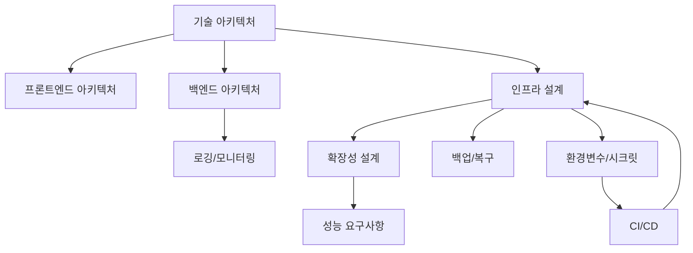

# 00. 기술 설계 문서 10종 최종본 INDEX

## 1. 문서 세트 목적

본 폴더는 급여납치 플랫폼의 기술 구현을 위한 최종본 Markdown 문서 10종으로 구성된다. 모든 문서는 모바일 앱, API 서버, Neon DB, Cloudflare, GitHub 배포 구조를 기준으로 문서상·이론상 추가 작업 없이 구현 가능한 기술 기준을 확정한다.

## 2. 포함 문서

| 번호 | 문서명                    | 목적                  | 파일명                                  |
| ---: | ------------------------- | --------------------- | --------------------------------------- |
|   01 | 기술 아키텍처 설계서      | 전체 시스템 구조 정의 | 01*기술*아키텍처*설계서*최종본.md       |
|   02 | 프론트엔드 아키텍처 문서  | 앱 코드 구조 고정     | 02*프론트엔드*아키텍처*문서*최종본.md   |
|   03 | 백엔드 아키텍처 문서      | 서버 구현 기준        | 03*백엔드*아키텍처*문서*최종본.md       |
|   04 | 인프라 설계서             | 배포 환경 기준        | 04*인프라*설계서\_최종본.md             |
|   05 | 확장성 설계서             | 대규모 접속 대비      | 05*확장성*설계서\_최종본.md             |
|   06 | 성능 요구사항 문서        | 앱 속도 기준          | 06*성능*요구사항*문서*최종본.md         |
|   07 | 로깅/모니터링 설계서      | 장애 추적 기준        | 07*로깅*모니터링*설계서*최종본.md       |
|   08 | 백업/복구 정책서          | 데이터 손실 방지      | 08*백업*복구*정책서*최종본.md           |
|   09 | 환경변수/시크릿 관리 문서 | 보안 배포             | 09*환경변수*시크릿*관리*문서\_최종본.md |
|   10 | CI/CD 문서                | GitHub 배포 자동화    | 10*CI_CD*문서\_최종본.md                |

## 3. 최종 기술 스택 확정

| 영역      | 확정 기술                                           |
| --------- | --------------------------------------------------- |
| 모바일 앱 | React Native + Expo + TypeScript                    |
| 상태관리  | TanStack Query + Zustand                            |
| 폼/검증   | React Hook Form + Zod                               |
| 라우팅    | Expo Router                                         |
| API 서버  | Cloudflare Workers + TypeScript + Hono              |
| DB        | Neon DB / PostgreSQL                                |
| DB 접근   | Drizzle ORM + Neon pooled connection                |
| 파일 저장 | Cloudflare R2 + CDN URL                             |
| 인증      | JWT Access Token + Refresh Token Rotation + OAuth   |
| 푸시      | FCM HTTP v1 + APNs 연동 토큰 관리                   |
| 관리자    | Cloudflare Pages 기반 Admin Web + Cloudflare Access |
| 배치      | Cloudflare Workers Cron Triggers                    |
| 모니터링  | Cloudflare Analytics/Logs + Sentry + DB 쿼리 로그   |
| 배포      | GitHub Actions + Cloudflare Deploy + Neon Migration |

## 4. 문서 간 참조 관계

## 5. 완성 판정 기준

| 기준                                                       | 완료 여부 |
| ---------------------------------------------------------- | --------- |
| 모바일 앱, API 서버, DB, Cloudflare, GitHub 배포 구조 확정 | 완료      |
| 프론트엔드/백엔드 폴더 구조 및 계층 책임 확정              | 완료      |
| 인프라, 도메인, CDN, 환경변수 기준 확정                    | 완료      |
| 평균 5,000명 동시 접속과 대규모 수시 접속 대응 기준 확정   | 완료      |
| 성능, 로깅, 장애 추적, 백업, 복구 기준 확정                | 완료      |
| 배포 자동화, 승인, 롤백 기준 확정                          | 완료      |
