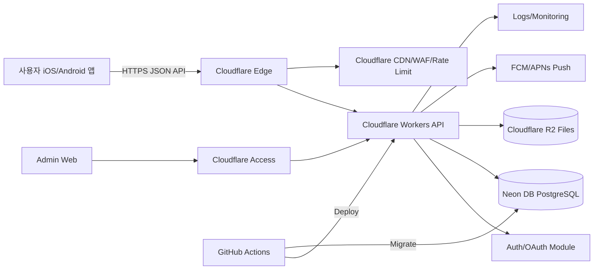
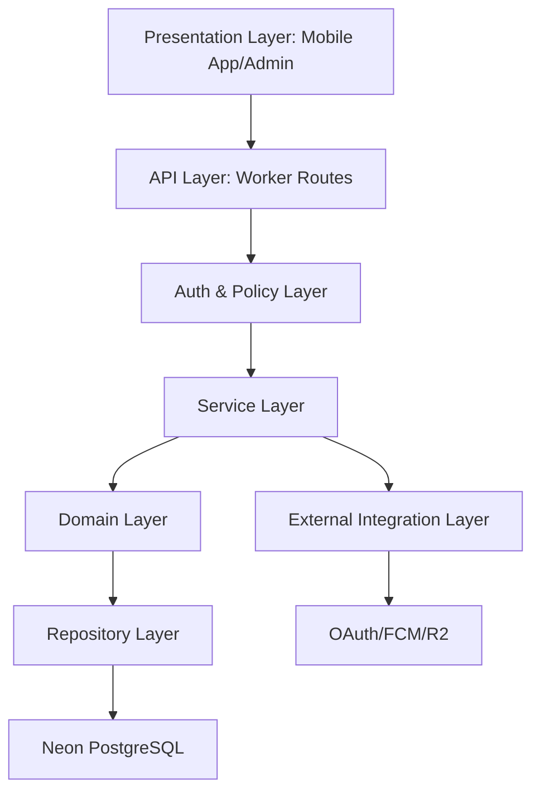

# 01. 기술 아키텍처 설계서 최종본

## 1. 문서 목적

본 문서는 급여납치 플랫폼의 전체 시스템 구조를 최종 확정한다. 모바일 앱, API 서버, Neon DB, Cloudflare, GitHub 배포 구조를 하나의 기준으로 통합하여 개발·운영·보안·확장성 판단의 최상위 기술 기준으로 사용한다.

## 2. 기술 아키텍처 최종 결론

급여납치 플랫폼은 **모바일 앱 중심의 서버리스 엣지 아키텍처**로 구현한다. 프론트엔드는 React Native/Expo 기반 모바일 앱으로 제공하고, API 서버는 Cloudflare Workers에 배포한다. 영속 데이터는 Neon DB PostgreSQL에 저장하며, 파일은 Cloudflare R2에 저장한다. GitHub Actions가 테스트, 빌드, 마이그레이션, 배포를 자동화한다.

## 3. 전체 구성도

## 4. 주요 시스템 컴포넌트

| 컴포넌트         | 기술                                  | 책임                                                       | 최종 배치                  |
| ---------------- | ------------------------------------- | ---------------------------------------------------------- | -------------------------- |
| 모바일 앱        | React Native, Expo, TypeScript        | 사용자 화면, 입력, 인증 토큰 보관, API 호출, 푸시 수신     | iOS/Android App Store 배포 |
| API Gateway/Edge | Cloudflare                            | TLS, WAF, Rate Limit, CDN, 라우팅                          | Cloudflare Zone            |
| API 서버         | Cloudflare Workers, Hono, TypeScript  | REST API, 인증/인가, 비즈니스 로직, 배치 트리거            | Cloudflare Workers         |
| 데이터베이스     | Neon DB PostgreSQL                    | 사용자, 급여, 지출, 예산, 커뮤니티, 알림, 광고 데이터 저장 | Neon Project               |
| 파일 저장소      | Cloudflare R2                         | 프로필 이미지, 게시글 첨부, 배너 이미지 저장               | R2 Bucket                  |
| 푸시 연동        | FCM HTTP v1, APNs                     | 예산 초과, 결제 예정, 레벨업, 커뮤니티 알림 발송           | Worker 내부 서비스         |
| 관리자           | Cloudflare Pages + Access             | 신고, 공지, 배너, 사용자 제재, 운영 로그                   | Cloudflare Pages           |
| CI/CD            | GitHub Actions                        | lint/test/build/migration/deploy/rollback                  | GitHub Repository          |
| 모니터링         | Cloudflare Logs, Sentry, Neon metrics | API 오류, 앱 오류, DB 지연, 배치 실패 추적                 | 운영 대시보드              |

## 5. 계층 구조

## 6. 데이터 흐름

### 6.1 급여 계획 생성 흐름

1. 모바일 앱이 급여일, 수령 예정 급여, 목표 납치금액을 입력받는다.
2. 앱은 입력값을 Zod schema로 1차 검증한다.
3. API 서버는 JWT를 검증하고 사용자 권한을 확인한다.
4. Service Layer가 금액 정책을 적용한다.
5. Repository Layer가 `payroll_plans`에 저장한다.
6. 예상 납치금액을 계산해 응답한다.
7. 앱은 TanStack Query cache를 갱신하고 홈 화면을 갱신한다.

### 6.2 변동지출 추가 흐름

1. 사용자가 지출 금액과 항목을 입력한다.
2. API는 `variable_expenses`에 기록한다.
3. 같은 날짜의 `daily_budgets.used_amount`를 증가시킨다.
4. 남은금액이 0원 미만이면 예산 초과 알림을 생성한다.
5. 홈 화면은 사용금액, 남은금액, 납치금액을 재계산하여 표시한다.

### 6.3 커뮤니티 글쓰기 흐름

1. 사용자가 제목, 본문, 게시판, 익명/질문 여부를 선택한다.
2. 첨부가 있으면 R2 사전 서명 URL로 업로드한다.
3. API는 첨부 객체 검증 후 게시글을 등록한다.
4. 금칙어/신고 위험 키워드를 운영 정책에 따라 표시한다.
5. 게시글 목록 cache를 무효화한다.

## 7. 도메인 경계

| 도메인       | 포함 기능                            | 분리 기준             |
| ------------ | ------------------------------------ | --------------------- |
| Auth         | 로그인, 토큰, 세션, OAuth            | 보안과 계정 상태 관리 |
| User         | 프로필, 설정, 탈퇴                   | 개인 식별/설정 정보   |
| Payroll      | 급여 계획, 납치금액, 월말 확정       | 월급 관리 핵심 로직   |
| Expense      | 고정지출, 변동지출, 일일 예산        | 소비·예산 관리        |
| Growth       | 독서, 뉴스, 영어, 건강, 경험치, 레벨 | 자기계발 루틴         |
| Community    | 게시글, 댓글, 좋아요, 신고           | 사용자 생성 콘텐츠    |
| Notification | 앱 알림, 푸시, 읽음                  | 리텐션과 이벤트 전달  |
| Ad/Partner   | 배너, 클릭, 노출, 제휴               | 수익화와 광고 데이터  |
| Admin        | 운영자, 공지, 제재, 감사로그         | 운영 통제             |

## 8. 비기능 요구사항 최종값

| 항목             | 최종 기준                                                                                |
| ---------------- | ---------------------------------------------------------------------------------------- |
| 평균 동시 접속   | 5,000명 안정 처리                                                                        |
| 대규모 수시 접속 | 이벤트/푸시/급여일 트래픽 기준 최대 1,000만 사용자 대상 분산 접속 대비                   |
| API p95 응답     | 일반 조회 300ms 이하, 쓰기 500ms 이하, 복합 통계 1,000ms 이하                            |
| 앱 초기 로딩     | 캐시 사용자 기준 2초 이하, 신규 로그인 기준 3초 이하                                     |
| 가용성 목표      | 월간 99.9% 이상                                                                          |
| DB 연결          | Neon pooled connection 기본 사용                                                         |
| 데이터 보안      | TLS, token rotation, secret 분리, 개인정보 최소 접근                                     |
| 배포             | staging 검증 후 production 승인 배포                                                     |
| 롤백             | 앱은 이전 릴리즈 유지, API는 직전 Worker version, DB는 forward-compatible migration 원칙 |

## 9. 네트워크/보안 경계

| 구간                     | 보안 기준                                                                |
| ------------------------ | ------------------------------------------------------------------------ |
| 앱 ↔ API                 | HTTPS/TLS, Bearer token, certificate pinning은 2차 고도화 적용 가능      |
| API ↔ Neon DB            | SSL 연결, pooled connection, DB 계정 최소 권한                           |
| API ↔ R2                 | Cloudflare binding/secret 기반 접근, 공개 읽기 URL과 private object 분리 |
| Admin ↔ API              | Cloudflare Access + 관리자 RBAC + 2FA                                    |
| GitHub ↔ Cloudflare/Neon | GitHub Environment Secrets + deployment protection rule                  |

## 10. 장애 격리 원칙

| 장애 영역          | 격리 기준                                      | 사용자 영향           |
| ------------------ | ---------------------------------------------- | --------------------- |
| 커뮤니티 장애      | 급여/예산 API와 독립 라우팅                    | 급여 홈 사용 가능     |
| 광고 장애          | 광고 응답 실패 시 빈 배너 또는 기본 배너       | 핵심 기능 영향 없음   |
| 푸시 장애          | 앱 내 알림 생성은 유지, 외부 푸시만 재시도     | 앱 접속 시 확인 가능  |
| 레벨업 콘텐츠 장애 | 미션 완료/레벨 저장은 유지, 외부 콘텐츠만 제한 | 급여 기능 영향 없음   |
| DB 지연            | 읽기 cache, rate limit, degraded mode          | 최근 캐시 데이터 표시 |

## 11. 최종 수용 기준

| 기준      | 완료 조건                                                                               |
| --------- | --------------------------------------------------------------------------------------- |
| 전체 구조 | 모바일 앱, Cloudflare Workers, Neon DB, R2, GitHub Actions 구조가 하나로 연결되어 있다. |
| 보안      | 인증, 권한, 시크릿, 관리자 보호, DB 연결 보안 기준이 명시되어 있다.                     |
| 확장성    | 평균 동시 접속과 대규모 수시 접속을 위한 분산/캐싱/풀링 기준이 있다.                    |
| 운영성    | 로그, 모니터링, 백업, 롤백, 배포 자동화 기준이 있다.                                    |
| 구현성    | 개발자가 본 문서와 하위 기술 문서만으로 구조를 생성할 수 있다.                          |

## 공식 기준 참조

| 구분                         | 최종 적용 기준                                                                                       |
| ---------------------------- | ---------------------------------------------------------------------------------------------------- |
| Cloudflare 환경변수/시크릿   | 일반 환경변수는 설정값, secret은 비밀번호·토큰·API key 등 민감값에 사용한다.                         |
| Cloudflare Tunnel/Zero Trust | 내부 관리자·운영 도구는 공개 IP 없이 Cloudflare Access/Tunnel로 보호한다.                            |
| Neon DB                      | PostgreSQL 기준 DB로 사용하며, 서버리스/대규모 트래픽 대응을 위해 pooled connection을 기본 사용한다. |
| GitHub Actions               | 환경별 secret, deployment environment, 승인/보호 규칙을 사용해 staging/production 배포를 분리한다.   |

- Cloudflare Workers Environment Variables: https://developers.cloudflare.com/workers/configuration/environment-variables/
- Cloudflare Workers Secrets: https://developers.cloudflare.com/workers/configuration/secrets/
- Cloudflare Tunnel: https://developers.cloudflare.com/tunnel/
- Neon Connection Pooling: https://neon.tech/docs/connect/connection-pooling
- GitHub Actions Environments: https://docs.github.com/actions/deployment/targeting-different-environments/using-environments-for-deployment
