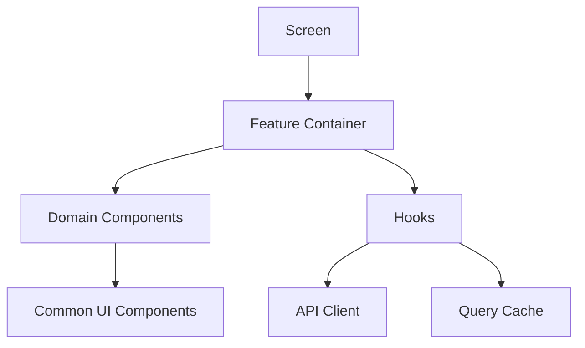

# 02. 프론트엔드 아키텍처 문서 최종본

## 1. 문서 목적

본 문서는 급여납치 모바일 앱의 프론트엔드 코드 구조, 상태관리, 라우팅, 컴포넌트, API 호출, 캐시, 오류 처리, 빌드 기준을 최종 확정한다.

## 2. 최종 기술 스택

| 영역              | 기술                                           | 적용 기준                                  |
| ----------------- | ---------------------------------------------- | ------------------------------------------ |
| 모바일 프레임워크 | React Native + Expo                            | iOS/Android 단일 코드베이스                |
| 언어              | TypeScript                                     | `strict: true` 필수                        |
| 라우팅            | Expo Router                                    | 파일 기반 라우팅, 인증/비인증 라우트 분리  |
| 서버 상태         | TanStack Query                                 | API cache, invalidation, retry 관리        |
| 클라이언트 상태   | Zustand                                        | 인증 상태, UI 상태, 임시 입력 상태         |
| 폼                | React Hook Form                                | 입력 성능과 검증 분리                      |
| 검증              | Zod                                            | API request/response schema 공유 가능 구조 |
| 보안 저장         | expo-secure-store                              | access/refresh token, device id 저장       |
| 푸시              | expo-notifications 또는 native FCM/APNs bridge | 푸시 토큰 등록/갱신                        |
| 스타일            | 디자인 시스템 tokens + StyleSheet              | 색상/간격/폰트/컴포넌트 일관성             |
| 테스트            | Jest + React Native Testing Library            | 컴포넌트/훅/유틸 테스트                    |
| E2E               | Detox 또는 Maestro                             | 핵심 사용자 플로우 검증                    |

## 3. 앱 라우팅 구조

```text
app/
  _layout.tsx
  index.tsx
  (auth)/
    login.tsx
    signup.tsx
    oauth-callback.tsx
  (onboarding)/
    payroll-setup.tsx
    fixed-expense-setup.tsx
    daily-budget-setup.tsx
  (tabs)/
    _layout.tsx
    payroll/index.tsx
    plan/index.tsx
    level/index.tsx
    community/index.tsx
    my/index.tsx
  notification/index.tsx
  community/post/[postId].tsx
  community/write.tsx
  settings/index.tsx
```

## 4. 폴더 구조 최종안

```text
src/
  app/                         # Expo Router 화면
  assets/                      # 이미지, 아이콘, 폰트
  components/
    common/                    # Button, Input, Modal, EmptyState
    payroll/                   # SalaryStatusCard, DailyBudgetCard
    plan/                      # PayrollPlanForm, FixedExpenseTable
    level/                     # GrowthTaskCard, LevelProgress
    community/                 # PostCard, CommentItem, BoardTabs
    notification/              # NotificationRow
    layout/                    # AppHeader, BottomTabBar, ScreenContainer
  constants/
    colors.ts
    spacing.ts
    typography.ts
    routeNames.ts
  domains/
    auth/
      api.ts
      hooks.ts
      schemas.ts
      store.ts
      types.ts
    payroll/
    expense/
    budget/
    growth/
    community/
    notification/
    profile/
    ads/
  lib/
    apiClient.ts
    queryClient.ts
    secureStore.ts
    errorMapper.ts
    formatMoney.ts
    date.ts
  stores/
    appStore.ts
    toastStore.ts
  types/
    api.ts
    common.ts
  tests/
```

## 5. 화면과 도메인 매핑

| 하단 탭/화면 | 담당 도메인                    | 주요 API                                                               | 주요 컴포넌트                                  |
| ------------ | ------------------------------ | ---------------------------------------------------------------------- | ---------------------------------------------- |
| 급여 홈      | payroll, expense, budget, ads  | `/payroll-plans/current`, `/daily-budgets/today`, `/variable-expenses` | SalaryStatusCard, DailyBudgetCard, ExpenseList |
| 계획         | payroll, fixedExpense, savings | `/payroll-plans`, `/fixed-expenses`, `/savings-plans`                  | PayrollPlanForm, PlanTable                     |
| LV UP        | growth                         | `/growth/tasks`, `/growth/complete`                                    | GrowthMenu, LevelProgress, ContentCard         |
| 커뮤니티     | community, file                | `/community/posts`, `/community/comments`, `/files`                    | BoardTabs, PostCard, WritePostForm             |
| 마이페이지   | profile, auth, notification    | `/users/me`, `/auth/logout`                                            | ProfileHeader, MyStatCards, MyMenuList         |
| 알림         | notification                   | `/notifications`, `/notifications/read`                                | NotificationRow, NotificationFilter            |

## 6. 상태관리 원칙

### 6.1 서버 상태

| 데이터        | 관리 방식               | cacheTime/staleTime | invalidation              |
| ------------- | ----------------------- | ------------------- | ------------------------- |
| 내 프로필     | TanStack Query          | stale 5분           | 프로필 수정, 로그아웃     |
| 급여 홈 요약  | TanStack Query          | stale 30초          | 지출 추가/삭제, 계획 저장 |
| 일일 예산     | TanStack Query          | stale 15초          | 변동지출 추가/수정/삭제   |
| 커뮤니티 목록 | TanStack Query infinite | stale 30초          | 글쓰기/삭제/신고          |
| 알림 목록     | TanStack Query          | stale 30초          | 읽음 처리/푸시 수신       |
| 레벨업 상태   | TanStack Query          | stale 1분           | 미션 완료                 |

### 6.2 클라이언트 상태

| 상태          | 저장소                   | 설명                                    |
| ------------- | ------------------------ | --------------------------------------- |
| authState     | Zustand + SecureStore    | token, 로그인 여부, onboardingCompleted |
| appUiState    | Zustand                  | toast, modal, loading overlay           |
| composeDraft  | Zustand 또는 local draft | 글쓰기 임시저장                         |
| selectedMonth | Zustand                  | 계획 화면 월 선택                       |

## 7. API Client 기준

```ts
export async function request<T>(config: ApiRequest): Promise<T> {
  const token = await secureToken.getAccessToken();
  const res = await fetch(`${API_BASE_URL}${config.path}`, {
    method: config.method,
    headers: {
      "Content-Type": "application/json",
      Authorization: token ? `Bearer ${token}` : "",
      "X-Request-Id": createRequestId(),
      ...config.headers,
    },
    body: config.body ? JSON.stringify(config.body) : undefined,
  });

  if (res.status === 401) {
    await authService.refreshOrLogout();
  }

  const json = await res.json();
  if (!json.success) throw mapApiError(json.error);
  return json.data as T;
}
```

## 8. 오류 처리 UX

| 오류 유형      | 사용자 표시                          | 내부 처리                           |
| -------------- | ------------------------------------ | ----------------------------------- |
| 네트워크 끊김  | “인터넷 연결을 확인해주세요.”        | 재시도 버튼, 마지막 cache 표시      |
| 인증 만료      | 별도 노출 없이 토큰 재발급           | 실패 시 로그인 이동                 |
| 금액 검증 실패 | 입력창 하단 오류                     | Zod + API fieldErrors 표시          |
| 서버 오류      | “잠시 후 다시 시도해주세요.”         | Sentry capture, requestId 표시 가능 |
| 권한 없음      | “접근할 수 없는 화면입니다.”         | 홈 이동                             |
| 게시글 삭제됨  | “삭제되었거나 숨김 처리된 글입니다.” | 목록 refresh                        |

## 9. 컴포넌트 계층



## 10. 컴포넌트 작성 규칙

| 규칙      | 기준                                           |
| --------- | ---------------------------------------------- |
| Props     | 명시적 interface 사용, any 금지                |
| 스타일    | 컴포넌트 내부 StyleSheet 또는 디자인 토큰 사용 |
| 금액 표시 | `formatMoneyKRW(amount)`만 사용                |
| 날짜 표시 | `formatDateKST(date)`만 사용                   |
| API 호출  | 화면에서 직접 fetch 금지, domain hook 사용     |
| 로딩 상태 | Skeleton 또는 Card placeholder 사용            |
| 빈 상태   | EmptyState 컴포넌트 사용                       |
| 접근성    | 터치 요소 accessibilityLabel 필수              |

## 11. 인증 라우팅 정책

| 상태                                      | 진입 화면          |
| ----------------------------------------- | ------------------ |
| 토큰 없음                                 | 로그인             |
| 토큰 있음 + refresh 성공 + 급여 계획 없음 | 급여 초기 설정     |
| 토큰 있음 + 급여 계획 있음                | 급여 홈            |
| 탈퇴/정지 계정                            | 로그인 차단 안내   |
| 앱 업데이트 필요                          | 강제 업데이트 화면 |

## 12. 오프라인/캐시 정책

| 영역        | 오프라인 기준                                           |
| ----------- | ------------------------------------------------------- |
| 급여 홈     | 마지막 성공 응답 cache 표시, “마지막 업데이트” 표시     |
| 지출 추가   | 오프라인 상태에서는 임시 queue 저장 후 재연결 시 동기화 |
| 글쓰기      | 온라인 필요, 실패 시 draft 보존                         |
| 레벨업 완료 | 온라인 필요, 중복 완료 방지                             |
| 알림 목록   | 마지막 cache 표시, 읽음 처리는 온라인 시 반영           |

## 13. 빌드/릴리즈 기준

| 환경       | API Base URL      | 빌드 프로필 | 배포 대상                           |
| ---------- | ----------------- | ----------- | ----------------------------------- |
| local      | local/staging API | development | 개발자 기기                         |
| staging    | staging API       | preview     | 내부 QA/TestFlight/Internal testing |
| production | production API    | production  | App Store/Google Play               |

## 14. 프론트엔드 품질 게이트

| 항목        | 완료 기준                                            |
| ----------- | ---------------------------------------------------- |
| TypeScript  | `tsc --noEmit` 오류 0건                              |
| Lint        | ESLint 오류 0건                                      |
| 단위 테스트 | 핵심 유틸/컴포넌트 80% 이상                          |
| E2E         | 로그인, 급여 등록, 지출 추가, 글쓰기, 알림 확인 통과 |
| 접근성      | 주요 버튼 label, 터치 영역, 텍스트 대비 기준 충족    |
| 성능        | 홈 진입 2초 이하, 탭 전환 300ms 이하 체감            |

## 15. 최종 수용 기준

| 기준      | 완료 조건                                              |
| --------- | ------------------------------------------------------ |
| 코드 구조 | 폴더와 도메인 책임이 고정되어 있다.                    |
| 상태관리  | 서버 상태와 클라이언트 상태가 분리되어 있다.           |
| 라우팅    | 인증/온보딩/탭/상세 화면 경로가 확정되어 있다.         |
| API 연결  | 공통 client, token refresh, error mapping 기준이 있다. |
| 품질      | 테스트, 접근성, 성능 게이트가 명시되어 있다.           |
