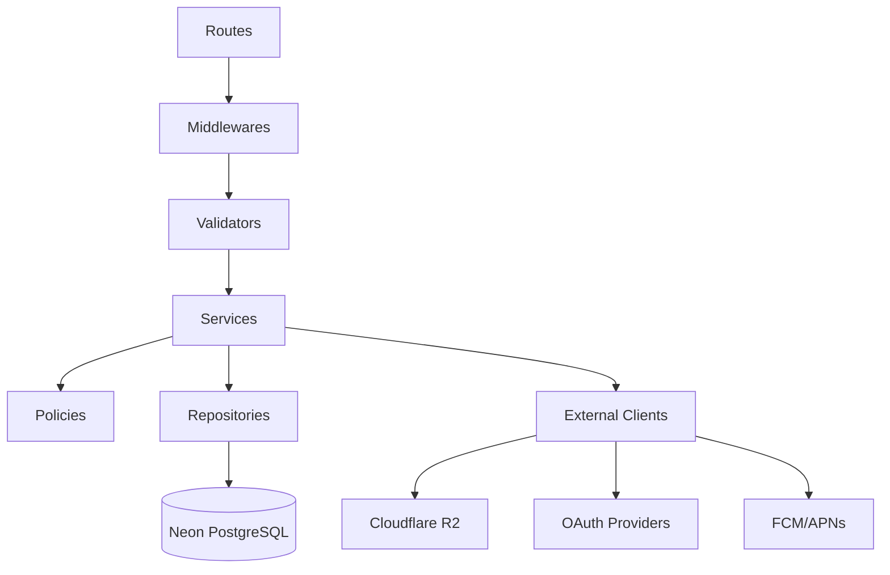

# 03. 백엔드 아키텍처 문서 최종본

## 1. 문서 목적

본 문서는 급여납치 API 서버의 계층 구조, 모듈 구조, 라우팅, 서비스, DB 접근, 인증 모듈, 외부 연동, 예외 처리 기준을 최종 확정한다.

## 2. 최종 백엔드 스택

| 영역       | 기술                         | 기준                          |
| ---------- | ---------------------------- | ----------------------------- |
| Runtime    | Cloudflare Workers           | 엣지 서버리스 API 실행        |
| Framework  | Hono                         | Worker 친화 라우팅/미들웨어   |
| Language   | TypeScript                   | strict mode                   |
| ORM        | Drizzle ORM                  | PostgreSQL schema/type 안전성 |
| DB         | Neon DB PostgreSQL           | pooled connection 기본        |
| Validation | Zod                          | request/response 검증         |
| Auth       | JWT + Refresh Token Rotation | 사용자/관리자/시스템 권한     |
| Storage    | Cloudflare R2                | 파일 업로드/첨부              |
| Scheduler  | Workers Cron Triggers        | 알림/월말 확정/통계           |
| Logging    | structured JSON logs         | requestId 기반 추적           |

## 3. 백엔드 레이어 구조



## 4. 백엔드 폴더 구조

```text
apps/api/
  src/
    index.ts
    app.ts
    config/
      env.ts
      cors.ts
      constants.ts
    middlewares/
      auth.middleware.ts
      admin-auth.middleware.ts
      request-id.middleware.ts
      rate-limit.middleware.ts
      error.middleware.ts
      validation.middleware.ts
    routes/
      auth.routes.ts
      users.routes.ts
      payroll.routes.ts
      fixed-expenses.routes.ts
      savings.routes.ts
      daily-budgets.routes.ts
      variable-expenses.routes.ts
      notifications.routes.ts
      growth.routes.ts
      community.routes.ts
      files.routes.ts
      ads.routes.ts
      admin.routes.ts
      health.routes.ts
    domains/
      auth/
        auth.service.ts
        auth.repository.ts
        auth.schemas.ts
        token.service.ts
        oauth.service.ts
      payroll/
      expense/
      budget/
      growth/
      community/
      notification/
      file/
      ad/
      admin/
    db/
      client.ts
      schema.ts
      migrations/
    lib/
      errors.ts
      response.ts
      money.ts
      date.ts
      logger.ts
      idempotency.ts
      pagination.ts
    external/
      r2.client.ts
      fcm.client.ts
      naver.client.ts
      kakao.client.ts
      google.client.ts
    scheduled/
      daily-budget-reset.job.ts
      fixed-payment-alert.job.ts
      payroll-close.job.ts
      notification-dispatch.job.ts
      analytics-rollup.job.ts
```

## 5. Route Layer 기준

| 책임          | 기준                                                  |
| ------------- | ----------------------------------------------------- |
| endpoint 선언 | Hono route에서 method/path만 선언                     |
| request 파싱  | Zod schema로 body/query/params 검증                   |
| 인증          | middleware에서 처리하고 route에서는 `ctx.user`만 사용 |
| response      | `ok`, `created`, `noContent`, `fail` helper만 사용    |
| 비즈니스 로직 | route에 작성 금지, service에 위임                     |

## 6. Service Layer 기준

| 도메인              | 핵심 책임                                       |
| ------------------- | ----------------------------------------------- |
| AuthService         | 로그인, 토큰 발급/재발급, 세션 폐기, OAuth 연결 |
| PayrollService      | 급여 계획 생성/수정, 납치금액 계산, 월말 확정   |
| ExpenseService      | 고정지출/변동지출 생성, 상태 변경, 예산 반영    |
| BudgetService       | 일일 예산 생성/조회/초과 판단                   |
| GrowthService       | 미션 조회/완료, 경험치, 레벨 계산               |
| CommunityService    | 게시글/댓글/좋아요/신고/숨김 처리               |
| NotificationService | 알림 생성, 읽음, 푸시 발송 queue                |
| FileService         | 업로드 URL 발급, 첨부 검증, 삭제                |
| AdService           | 배너 조회, 노출/클릭 로그                       |
| AdminService        | 신고 처리, 공지, 배너, 사용자 제재              |

## 7. Repository Layer 기준

| 규칙          | 최종 기준                                          |
| ------------- | -------------------------------------------------- |
| DB 접근       | repository에서만 수행                              |
| 트랜잭션      | 금액/상태 동시 변경은 transaction 필수             |
| soft delete   | `deleted_at IS NULL` 조건 기본 적용                |
| pagination    | repository에서 limit/offset 또는 cursor 처리       |
| query timeout | API 요청성 쿼리 3초, 배치성 쿼리 30초 초과 금지    |
| N+1 방지      | 목록 조회는 join/aggregation 또는 batch query 사용 |

## 8. 인증/인가 미들웨어

| Middleware   | 적용 대상         | 처리                              |
| ------------ | ----------------- | --------------------------------- |
| requestId    | 전체              | requestId 생성/전파               |
| cors         | 전체              | allowlist origin만 허용           |
| rateLimit    | 전체              | IP+user+route 기준 제한           |
| auth         | 사용자 API        | access token 검증                 |
| adminAuth    | 관리자 API        | 관리자 토큰, role, 2FA claim 확인 |
| serviceAuth  | 배치/내부 API     | service token 서명 검증           |
| validate     | body/query/params | Zod parse                         |
| errorHandler | 전체              | 표준 오류 응답 변환               |

## 9. 공통 응답 생성 기준

```ts
export const ok = <T>(data: T, meta: Meta) => ({
  success: true,
  data,
  meta,
});

export const fail = (error: AppError, meta: Meta) => ({
  success: false,
  error: {
    code: error.code,
    message: error.publicMessage,
    fieldErrors: error.fieldErrors ?? [],
  },
  meta,
});
```

## 10. 트랜잭션 필수 케이스

| 기능               | 트랜잭션 내용                                                            |
| ------------------ | ------------------------------------------------------------------------ |
| 변동지출 추가      | variable_expenses insert + daily_budgets update + notification 조건 생성 |
| 고정지출 납부완료  | fixed_expenses update + payroll expected expense 재계산                  |
| 레벨업 완료        | growth_task_completions insert + user_growth_stats update                |
| 게시글 삭제        | posts soft delete + attachments 상태 변경 + search index 제외            |
| 월말 납치금액 확정 | payroll_plans closed + monthly summary insert + 누적 금액 갱신           |

## 11. 멱등성 정책

| 요청             | Idempotency-Key 필수 여부 | 기준                     |
| ---------------- | ------------------------: | ------------------------ |
| 급여 계획 생성   |                      권장 | 같은 월 중복 방지        |
| 변동지출 추가    |                      필수 | 앱 재시도 중복 지출 방지 |
| 글쓰기 등록      |                      필수 | 중복 게시글 방지         |
| 파일 업로드 완료 |                      필수 | 동일 첨부 중복 연결 방지 |
| 미션 완료        |                      필수 | 경험치 중복 지급 방지    |
| 푸시 발송        |                      필수 | 같은 알림 중복 발송 방지 |

## 12. Rate Limit 기준

| API           | 제한                   |
| ------------- | ---------------------- |
| 로그인        | IP+email 기준 5회/15분 |
| 토큰 재발급   | session 기준 20회/시간 |
| 지출 추가     | 사용자 기준 120회/분   |
| 글쓰기        | 사용자 기준 10회/10분  |
| 댓글          | 사용자 기준 30회/10분  |
| 파일 URL 발급 | 사용자 기준 30회/10분  |
| 관리자 제재   | 관리자 기준 100회/시간 |

## 13. 외부 연동 장애 처리

| 연동           | 장애 처리                                                 |
| -------------- | --------------------------------------------------------- |
| OAuth Provider | 로그인 실패 응답, provider 장애 로그, 재시도 안내         |
| FCM/APNs       | notification 상태 FAILED_RETRYABLE 저장, 재시도 job 처리  |
| R2             | 업로드 URL 발급 실패 시 FILE_STORAGE_UNAVAILABLE 반환     |
| Neon DB        | retry 1회 이하, circuit breaker, read cache fallback 적용 |

## 14. Health Check

| Endpoint              | 인증 | 반환                             |
| --------------------- | ---- | -------------------------------- |
| `GET /health`         | 없음 | API alive                        |
| `GET /health/ready`   | 내부 | DB/R2/OAuth 설정 ready 상태      |
| `GET /health/version` | 없음 | app version, git sha, deployedAt |

## 15. 최종 수용 기준

| 기준      | 완료 조건                                                       |
| --------- | --------------------------------------------------------------- |
| 계층 분리 | route/service/repository/policy/external layer가 분리되어 있다. |
| DB 안정성 | 트랜잭션, pool, timeout, soft delete 기준이 있다.               |
| 보안      | 인증/인가/rate limit/error response가 표준화되어 있다.          |
| 운영성    | health check, logging, retry, 장애 격리 기준이 있다.            |
| 구현성    | 폴더 구조와 모듈 책임만으로 코드 생성이 가능하다.               |
