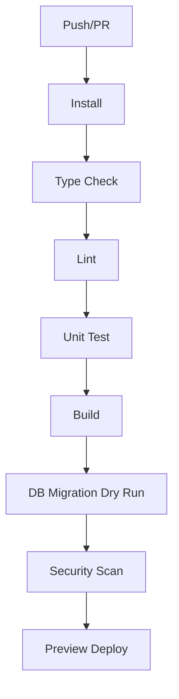
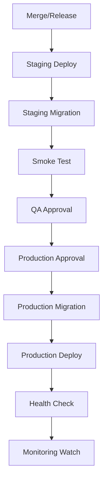

# 10. CI/CD 문서 최종본

## 1. 문서 목적

본 문서는 급여납치 플랫폼의 GitHub 배포 자동화, 브랜치 전략, 테스트 자동화, 배포 승인, 마이그레이션, 롤백 기준을 최종 확정한다.

## 2. 브랜치 전략

| 브랜치      | 목적            | 배포                            |
| ----------- | --------------- | ------------------------------- |
| `main`      | production 기준 | production 승인 배포            |
| `develop`   | 통합 개발       | development 자동 배포           |
| `release/*` | 출시 후보       | staging 자동 배포               |
| `feature/*` | 기능 개발       | PR preview 테스트               |
| `fix/*`     | 버그 수정       | PR preview 테스트               |
| `hotfix/*`  | 운영 긴급 수정  | staging 검증 후 production 승인 |

## 3. 배포 환경

| GitHub Environment | 대상                  | 보호 규칙                                     |
| ------------------ | --------------------- | --------------------------------------------- |
| development        | dev Worker/DB branch  | 자동 배포 가능                                |
| staging            | stg Worker/DB branch  | CI 통과 필수                                  |
| production         | prod Worker/Neon main | 수동 승인, main 브랜치 제한, secret 접근 제한 |

## 4. CI Pipeline



## 5. CD Pipeline



## 6. 필수 Workflow

| Workflow                | Trigger                       | 작업                                           |
| ----------------------- | ----------------------------- | ---------------------------------------------- |
| `ci.yml`                | pull_request, push            | install, typecheck, lint, test, build          |
| `api-preview.yml`       | pull_request                  | preview Worker deploy, preview DB branch       |
| `staging-deploy.yml`    | release/\* 또는 develop merge | staging deploy, migration, smoke test          |
| `production-deploy.yml` | main tag/release              | approval, migration, deploy, health check      |
| `mobile-build.yml`      | release tag                   | EAS build, artifact upload                     |
| `rollback.yml`          | manual                        | Worker rollback, config rollback, incident log |
| `migration-check.yml`   | PR                            | DB schema diff, destructive migration block    |

## 7. 품질 게이트

| 단계              | 통과 기준                                        |
| ----------------- | ------------------------------------------------ |
| Type Check        | 오류 0건                                         |
| Lint              | 오류 0건, warning 제한                           |
| Unit Test         | 핵심 도메인 테스트 통과                          |
| API Contract Test | 공통 응답/오류 포맷 통과                         |
| Migration Dry Run | staging/preview DB 적용 가능                     |
| Security Scan     | secret scan, dependency audit 통과               |
| Smoke Test        | health, login, payroll home, expense create 통과 |
| Performance Smoke | 주요 API p95 기준 초과 없음                      |

## 8. DB Migration 정책

| 원칙               | 기준                                            |
| ------------------ | ----------------------------------------------- |
| Forward-compatible | API 구버전/신버전이 동시에 동작 가능해야 한다.  |
| Destructive change | 즉시 금지, 2단계 배포 후 제거한다.              |
| Transaction        | 가능한 migration은 transaction 적용             |
| Rollback           | DB rollback보다 forward fix 우선                |
| Review             | production migration은 백엔드/DB 담당 승인 필요 |

### 8.1 안전한 컬럼 변경 절차

1. nullable 컬럼 추가.
2. API가 새 컬럼을 쓰되 기존 컬럼 fallback 유지.
3. backfill batch 실행.
4. not null/default 제약 추가.
5. 기존 컬럼 제거는 다음 릴리즈 이후 수행.

## 9. 배포 승인 기준

| 환경        | 승인자                           | 조건                                                       |
| ----------- | -------------------------------- | ---------------------------------------------------------- |
| development | 자동                             | CI 통과                                                    |
| staging     | 개발 리드                        | CI + migration dry run 통과                                |
| production  | 대표/기술책임자 또는 지정 승인자 | staging QA, smoke test, migration 검토, rollback plan 확인 |

## 10. Rollback 정책

| 대상        | 방식                                       |
| ----------- | ------------------------------------------ |
| Worker API  | 직전 배포 version으로 rollback             |
| Admin Pages | 직전 Pages deployment로 rollback           |
| Mobile App  | store staged rollout 중단 또는 hotfix 배포 |
| DB Schema   | 원칙적으로 forward fix, PITR은 최후 수단   |
| Feature     | remote config/feature flag로 비활성화      |
| 배너/공지   | 관리자에서 즉시 비활성화                   |

## 11. 배포 후 검증

| 검증            | 기준                           |
| --------------- | ------------------------------ |
| `/health`       | 200 OK                         |
| `/health/ready` | DB/R2/OAuth 설정 정상          |
| 로그인          | 이메일/소셜 중 최소 1개 정상   |
| 급여 홈         | 현재 급여/예산 조회 정상       |
| 지출 추가       | 테스트 계정에서 생성/삭제 정상 |
| 커뮤니티        | 목록/상세 조회 정상            |
| 알림            | 앱 내 알림 목록 정상           |
| 로그            | 오류율/지연 급증 없음          |

## 12. 예시 GitHub Actions 구조

```yaml
name: ci
on:
  pull_request:
  push:
    branches: [develop, main]
jobs:
  quality:
    runs-on: ubuntu-latest
    steps:
      - uses: actions/checkout@v4
      - uses: pnpm/action-setup@v4
      - uses: actions/setup-node@v4
        with:
          node-version: "22"
          cache: "pnpm"
      - run: pnpm install --frozen-lockfile
      - run: pnpm typecheck
      - run: pnpm lint
      - run: pnpm test
      - run: pnpm build
```

## 13. 배포 실패 대응

| 실패 지점                 | 대응                                      |
| ------------------------- | ----------------------------------------- |
| install/test 실패         | 배포 중단, PR 수정                        |
| migration dry run 실패    | schema 수정, production 배포 금지         |
| staging smoke 실패        | release 차단                              |
| production migration 실패 | API 배포 중단, forward fix 또는 복구 검토 |
| production health 실패    | 즉시 Worker rollback                      |
| 배포 후 오류율 증가       | incident 생성, rollback/hotfix 결정       |

## 14. 최종 수용 기준

| 기준   | 완료 조건                                        |
| ------ | ------------------------------------------------ |
| 브랜치 | main/develop/release/feature/hotfix 전략이 있다. |
| 자동화 | CI/CD workflow와 trigger가 정의되어 있다.        |
| 승인   | staging/production 보호 규칙이 있다.             |
| DB     | migration 안전 원칙이 있다.                      |
| 롤백   | API/Admin/App/DB/Feature별 기준이 있다.          |
